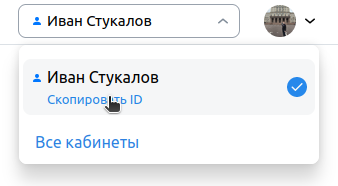

# Проект [VK Реклама](https://ads.vk.com)

**Авторизационные данные**

**Тестовый аккаунт:** primerovprimer91@gmail.com

**Пароль:** _уточнить в ЛС_

## [Справка](https://ads.vk.com/help)

**Авторизация не требуется**

**Поиск**

* Справка. При вводе слова или его части в поле поиска, под полем появляется список вариантов, в которых содержится эта
  подстрока

**Навигация**

* Справка. При нажатии на плитку "Авторизация" редиректит на https://ads.vk.com/help/categories/authorization
* Справка. При нажатии на плитку "Как настроить рекламу" редиректит на https://ads.vk.com/help/categories/general
* Справка. При нажатии на плитку "Инструменты рекламы" редиректит на https://ads.vk.com/help/categories/features
* Справка. При нажатии на плитку "Статистика и финансы" редиректит на https://ads.vk.com/help/categories/statistics
* Справка. При нажатии на плитку "Документы" редиректит на https://ads.vk.com/help/categories/documents
* Справка. При нажатии на плитку "Упрощенный кабинет" редиректит на https://ads.vk.com/help/categories/mini_ads
* Справка. При нажатии на плитку "FAQ" редиректит на https://ads.vk.com/help/categories/faq
* Справка. При нажатии на плитку "Кабинет партнера" редиректит на https://ads.vk.com/help/categories/partner

### [Авторизация](https://ads.vk.com/help/categories/authorization)

* Справка. Авторизация. При нажатии на пункт "Создание нового кабинета, авторизация" редиректит
  на https://ads.vk.com/help/articles/new_account
* Справка. Авторизация. При нажатии на пункт "Агентствам: регистрация и импорт кабинета агентства" редиректит
  на https://ads.vk.com/help/articles/agency_registration
* Справка. Авторизация. При нажатии на пункт "Копирование аудиторий и кампаний" редиректит
  на https://ads.vk.com/help/subcategories/import
* Справка. Авторизация. При нажатии на подпункт "Копирование кампаний из myTarget" пункта "Копирование аудиторий и
  кампаний" редиректит на https://ads.vk.com/help/articles/copy_mt
* Справка. Авторизация. При нажатии на пункт "Мультиаккаунты" редиректит
  на https://ads.vk.com/help/articles/additionalaccounts
* Справка. Авторизация. При нажатии на пункт "Подключение VK ID" редиректит
  на https://ads.vk.com/help/articles/vk_id_connect
* Справка. Авторизация. При нажатии на пункт "Удаление аккаунта" редиректит
  на https://ads.vk.com/help/articles/delete_account
* Справка. Авторизация. Любой из вышеперечисленных пунктов. При нажатии на кнопку "Авторизация", редиректит на
  https://ads.vk.com/help/categories/authorization

### [Как настроить рекламу](https://ads.vk.com/help/categories/general)

* Справка. Как настроить рекламу. При нажатии на пункт "Продвижение в соцсетях" редиректит
  на https://ads.vk.com/help/subcategories/network
* Справка. Как настроить рекламу. При нажатии на пункт "Мобильные приложения" редиректит
  на https://ads.vk.com/help/subcategories/apps
* Справка. Как настроить рекламу. При нажатии на пункт "Сайты" редиректит
  на https://ads.vk.com/help/subcategories/sites
* Справка. Как настроить рекламу. При нажатии на пункт "Дзен" редиректит
  на https://ads.vk.com/help/subcategories/dzen
* Справка. Как настроить рекламу. При нажатии на пункт "Каталоги товаров" редиректит
  на https://ads.vk.com/help/subcategories/ecomm
* Справка. Как настроить рекламу. При нажатии на пункт "Лид-формы" редиректит
  на https://ads.vk.com/help/subcategories/lead_forms
* Справка. Как настроить рекламу. При нажатии на пункт "Медийная реклама" редиректит
  на https://ads.vk.com/help/subcategories/branding_ads"
* Справка. Как настроить рекламу. При нажатии на пункт "Как завести рекламу" редиректит
  на https://ads.vk.com/help/subcategories/start
* Справка. Как настроить рекламу. При нажатии на пункт "Агентствам" редиректит
  на https://ads.vk.com/help/subcategories/agency
* Справка. Как настроить рекламу. Любой из подпунктов вышеперечисленных пунктов. При нажатии на кнопку "Как настроить
  рекламу", редиректит на https://ads.vk.com/help/categories/authorization

#### [Продвижение в соцсетях](https://ads.vk.com/help/subcategories/network)

* Справка. Как настроить рекламу. Продвижение в соцсетях. При нажатии на пункт Продвижение видео и трансляций редиректит
  на https://ads.vk.com/help/articles/video
* Справка. Как настроить рекламу. Продвижение в соцсетях. При нажатии на пункт Продвижение музыки редиректит
  на https://ads.vk.com/help/articles/music
* Справка. Как настроить рекламу. Продвижение в соцсетях. При нажатии на пункт Продвижение мини-приложений (VK Mini
  Apps) редиректит на https://ads.vk.com/help/articles/mini_app
* Справка. Как настроить рекламу. Продвижение в соцсетях. При нажатии на пункт Как отправлять события из мини-приложения
  редиректит на https://ads.vk.com/help/articles/VKWebAppTrackEvent
* Справка. Как настроить рекламу. Продвижение в соцсетях. При нажатии на пункт Продвижение сообществ редиректит
  на https://ads.vk.com/help/articles/engagement
* Справка. Как настроить рекламу. Продвижение в соцсетях. При нажатии на пункт Продвижение личных профилей редиректит
  на https://ads.vk.com/help/articles/profile
* Справка. Как настроить рекламу. Продвижение в соцсетях. При нажатии на пункт Как настроить личный профиль перед
  продвижением редиректит на https://ads.vk.com/help/articles/profile_settings
* Справка. Как настроить рекламу. Продвижение в соцсетях. При нажатии на пункт Продвижение групп в Одноклассниках
  редиректит на https://ads.vk.com/help/articles/ok_groups

#### [Мобильные приложения](https://ads.vk.com/help/subcategories/apps)

* Справка. Как настроить рекламу. Мобильные приложения. При нажатии на пункт Запуск рекламы приложения редиректит
  на https://ads.vk.com/help/articles/app_campaign
* Справка. Как настроить рекламу. Мобильные приложения. При нажатии на пункт Добавление нового приложения редиректит
  на https://ads.vk.com/help/articles/add_app
* Справка. Как настроить рекламу. Мобильные приложения. При нажатии на пункт Интеграция приложения с трекером редиректит
  на https://ads.vk.com/help/articles/integration_tracker
* Справка. Как настроить рекламу. Мобильные приложения. При нажатии на пункт Интеграция приложений из RuStore с
  трекерами редиректит на https://ads.vk.com/help/articles/rustore_integration_tracker
* Справка. Как настроить рекламу. Мобильные приложения. При нажатии на пункт Карточки приложений редиректит
  на https://ads.vk.com/help/articles/apps
* Справка. Как настроить рекламу. Мобильные приложения. При нажатии на пункт SKAdNetwork редиректит
  на https://ads.vk.com/help/articles/skadnetwork
* Справка. Как настроить рекламу. Мобильные приложения. При нажатии на пункт Запуск кампаний приложений из RuStore
  редиректит на https://ads.vk.com/help/articles/rustore_direct_links
* Справка. Как настроить рекламу. Мобильные приложения. При нажатии на пункт Макросы в трекинг ссылках редиректит
  на https://ads.vk.com/help/articles/tracking_links

#### [Сайты](https://ads.vk.com/help/subcategories/sites)

* Справка. Как настроить рекламу. Сайты. При нажатии на пункт Запуск рекламы сайта редиректит
  на https://ads.vk.com/help/articles/sites
* Справка. Как настроить рекламу. Сайты. При нажатии на пункт Пиксель VK Рекламы редиректит
  на https://ads.vk.com/help/articles/pixel
* Справка. Как настроить рекламу. Сайты. При нажатии на пункт Аудиторные теги пикселя редиректит
  на https://ads.vk.com/help/articles/audience_tags
* Справка. Как настроить рекламу. Сайты. При нажатии на пункт Передача офлайн-событий в пиксель редиректит
  на https://ads.vk.com/help/articles/offline_events
* Справка. Как настроить рекламу. Сайты. При нажатии на пункт Атрибуция конверсий для сайтов редиректит
  на https://ads.vk.com/help/articles/site_attribution

#### [Дзен](https://ads.vk.com/help/subcategories/dzen)

* Справка. Как настроить рекламу. Дзен. При нажатии на пункт Как запустить продвижение в Дзене редиректит
  на https://ads.vk.com/help/articles/promo_dzen

#### [Каталоги товаров](https://ads.vk.com/help/subcategories/ecomm)

* Справка. Как настроить рекламу. Каталоги товаров. При нажатии на пункт Запуск товарной рекламы для сайтов и мобильных
  приложений редиректит на https://ads.vk.com/help/articles/feed_campaign
* Справка. Как настроить рекламу. Каталоги товаров. При нажатии на пункт Запуск товарной рекламы для сообществ ВКонтакте
  редиректит на https://ads.vk.com/help/articles/feed_campaign_community
* Справка. Как настроить рекламу. Каталоги товаров. При нажатии на пункт Запуск товарной рекламы для маркетплейсов
  редиректит на https://ads.vk.com/help/articles/feed_campaign_marketplace
* Справка. Как настроить рекламу. Каталоги товаров. При нажатии на пункт Центр коммерции (интерфейс) редиректит
  на https://ads.vk.com/help/innersubs/ecomm_interface
* Справка. Как настроить рекламу. Каталоги товаров. При нажатии на пункт Каталоги редиректит
  на https://ads.vk.com/help/innersubs/feed_catalog
* Справка. Как настроить рекламу. Каталоги товаров. При нажатии на пункт Динамический ретаргетинг редиректит
  на https://ads.vk.com/help/innersubs/dyn_ret
* Справка. Как настроить рекламу. Каталоги товаров. При нажатии на пункт Диплинки и трекинг-ссылки в рекламе продуктов
  из каталога редиректит на https://ads.vk.com/help/articles/feed_deeplinks
* Справка. Как настроить рекламу. Каталоги товаров. При нажатии на пункт Макросы в рекламе продуктов из каталога
  редиректит на https://ads.vk.com/help/articles/feed_macro

#### [Лид-формы](https://ads.vk.com/help/subcategories/lead_forms)

* Справка. Как настроить рекламу. Лид-формы. При нажатии на пункт Запуск рекламы с лид-формой редиректит
  на https://ads.vk.com/help/articles/lead_forms

#### [Медийная реклама](https://ads.vk.com/help/subcategories/branding_ads)

* Справка. Как настроить рекламу. Медийная реклама. При нажатии на пункт Запуск медийной рекламы редиректит
  на https://ads.vk.com/help/articles/branding

#### [Как завести рекламу](https://ads.vk.com/help/subcategories/start)

* Справка. Как настроить рекламу. Как завести рекламу. При нажатии на пункт Создание рекламы редиректит
  на https://ads.vk.com/help/articles/creating
* Справка. Как настроить рекламу. Как завести рекламу. При нажатии на пункт Лимит количества объявлений редиректит
  на https://ads.vk.com/help/articles/ad_limits
* Справка. Как настроить рекламу. Как завести рекламу. При нажатии на пункт Добавление редиректа в белый список
  редиректит на https://ads.vk.com/help/articles/add_redirect
* Справка. Как настроить рекламу. Как завести рекламу. При нажатии на пункт Предпросмотр объявлений редиректит
  на https://ads.vk.com/help/articles/banner_preview
* Справка. Как настроить рекламу. Как завести рекламу. При нажатии на пункт Редактирование кампаний, группы и объявления
  редиректит на https://ads.vk.com/help/articles/edit_campaign
* Справка. Как настроить рекламу. Как завести рекламу. При нажатии на пункт Удаление и восстановление кампаний, групп и
  объявлений редиректит на https://ads.vk.com/help/articles/delete_campaign

#### [Агентствам](https://ads.vk.com/help/subcategories/agency)

* Справка. Как настроить рекламу. Агентствам. При нажатии на пункт Клиенты агентства редиректит
  на https://ads.vk.com/help/articles/agency_clients
* Справка. Как настроить рекламу. Агентствам. При нажатии на пункт Менеджеры агентства редиректит
  на https://ads.vk.com/help/articles/agency_managers

### [Инструменты рекламы](https://ads.vk.com/help/categories/features)

* Справка. Инструменты рекламы. При нажатии на пункт Объекты рекламы редиректит
  на https://ads.vk.com/help/articles/objective
* Справка. Инструменты рекламы. При нажатии на пункт Стратегии ставок редиректит
  на https://ads.vk.com/help/articles/bid_strategy
* Справка. Инструменты рекламы. При нажатии на пункт UTM-метки редиректит на https://ads.vk.com/help/articles/utm
* Справка. Инструменты рекламы. При нажатии на пункт Оптимизация бюджета редиректит
  на https://ads.vk.com/help/articles/optimization
* Справка. Инструменты рекламы. При нажатии на пункт Таргетинги редиректит
  на https://ads.vk.com/help/articles/technology
* Справка. Инструменты рекламы. При нажатии на пункт Аудитории и списки редиректит
  на https://ads.vk.com/help/subcategories/audiences_lists
* Справка. Инструменты рекламы. При нажатии на пункт Форматы рекламы редиректит
  на https://ads.vk.com/help/articles/formats
* Справка. Инструменты рекламы. При нажатии на пункт Места размещения редиректит
  на https://ads.vk.com/help/articles/placements
* Справка. Инструменты рекламы. При нажатии на пункт Аукцион редиректит на https://ads.vk.com/help/articles/auction
* Справка. Инструменты рекламы. При нажатии на пункт Автогенератор текстовых креативов редиректит
  на https://ads.vk.com/help/articles/text_autogen
* Справка. Инструменты рекламы. При нажатии на пункт Изображения и видео редиректит
  на https://ads.vk.com/help/subcategories/creatives
* Справка. Инструменты рекламы. При нажатии на пункт История изменений кабинета редиректит
  на https://ads.vk.com/help/articles/account_history
* Справка. Инструменты рекламы. При нажатии на пункт API VK Рекламы редиректит
  на https://ads.vk.com/help/articles/help_api

#### [Аудитории и списки](https://ads.vk.com/help/subcategories/audiences_lists)

* Справка. Инструменты рекламы. Аудитории и списки. При нажатии на пункт Аудитории редиректит
  на https://ads.vk.com/help/articles/audiences
* Справка. Инструменты рекламы. Аудитории и списки. При нажатии на пункт Списки пользователей редиректит
  на https://ads.vk.com/help/articles/user_lists
* Справка. Инструменты рекламы. Аудитории и списки. При нажатии на пункт Перенос аудиторий из myTarget редиректит
  на https://ads.vk.com/help/articles/copy_audience_mt
* Справка. Инструменты рекламы. Аудитории и списки. При нажатии на пункт Перенос аудиторий из ВКонтакте редиректит
  на https://ads.vk.com/help/articles/copy_audience_vk
* Справка. Инструменты рекламы. Аудитории и списки. При нажатии на пункт Загрузка внешней аудитории редиректит
  на https://ads.vk.com/help/articles/external_audiences
* Справка. Инструменты рекламы. Аудитории и списки. При нажатии на пункт Аудитория на основе реакций на пост ВКонтакте
  редиректит на https://ads.vk.com/help/articles/audience_post_vk

#### [Изображения и видео](https://ads.vk.com/help/subcategories/creatives)

* Справка. Инструменты рекламы. Изображения и видео. При нажатии на пункт Автогенератор видеокреативов редиректит
  на https://ads.vk.com/help/articles/video_autogen
* Справка. Инструменты рекламы. Изображения и видео. При нажатии на пункт Медиатека редиректит
  на https://ads.vk.com/help/articles/medialibrary
* Справка. Инструменты рекламы. Изображения и видео. При нажатии на пункт Дорисовка изображений редиректит
  на https://ads.vk.com/help/articles/refine_image
* Справка. Инструменты рекламы. Изображения и видео. При нажатии на пункт Умное кадрирование изображений редиректит
  на https://ads.vk.com/help/articles/smart_crop
* Справка. Инструменты рекламы. Изображения и видео. При нажатии на пункт Галерея изображений, созданных нейросетью
  редиректит на https://ads.vk.com/help/articles/photobank

### [Статистика и финансы](https://ads.vk.com/help/categories/statistics)

* Справка. Статистика и финансы. При нажатии на пункт Дашборд редиректит на https://ads.vk.com/help/articles/dashboard
* Справка. Статистика и финансы. При нажатии на пункт Агентствам: статистика по клиентам редиректит
  на https://ads.vk.com/help/articles/agency_statistics
* Справка. Статистика и финансы. При нажатии на пункт Статистика из приложений для веб-кампаний редиректит
  на https://ads.vk.com/help/articles/statistics_web2app
* Справка. Статистика и финансы. При нажатии на пункт Статусы кампаний, групп объявлений и объявлений редиректит
  на https://ads.vk.com/help/articles/campaign_status
* Справка. Статистика и финансы. При нажатии на пункт Биллинг и финансы редиректит
  на https://ads.vk.com/help/articles/billing
* Справка. Статистика и финансы. При нажатии на пункт Агентствам: баланс, оплата, закрывающие документы редиректит
  на https://ads.vk.com/help/articles/agency_billing

### [Документы](https://ads.vk.com/help/categories/documents)

* Справка. Документы. При нажатии на пункт Работа с ОРД VK редиректит на https://ads.vk.com/help/articles/guide_ord
* Справка. Документы. При нажатии на пункт Правила размещения рекламы редиректит
  на https://ads.vk.com/help/articles/moderation
* Справка. Документы. При нажатии на пункт Перечень документов, необходимых для запуска рекламы редиректит
  на https://ads.vk.com/help/articles/required_documents
* Справка. Документы. При нажатии на пункт Пояснения к Правилам размещения рекламы редиректит
  на https://ads.vk.com/help/articles/faq_moderation
* Справка. Документы. При нажатии на пункт Требования и рекомендации по оформлению рекламных объявлений редиректит
  на https://ads.vk.com/help/articles/ad_requirements
* Справка. Документы. При нажатии на пункт Предвыборная агитация в России редиректит
  на https://ads.vk.com/help/articles/election
* Справка. Документы. При нажатии на пункт Правила размещения агитационных материалов редиректит
  на https://ads.vk.com/help/articles/election_rules
* Справка. Документы. При нажатии на пункт Юридические документы редиректит
  на https://ads.vk.com/help/articles/legal_documents

### [Упрощенный кабинет](https://ads.vk.com/help/categories/mini_ads)

* Справка. Упрощенный кабинет. При нажатии на пункт Бюджет рекламного кабинета редиректит
  на https://ads.vk.com/help/articles/mini_ads_money
* Справка. Упрощенный кабинет. При нажатии на пункт ID объявления редиректит
  на https://ads.vk.com/help/articles/mini_ads_id
* Справка. Упрощенный кабинет. При нажатии на пункт Заполнение информации о компании или ИП редиректит
  на https://ads.vk.com/help/articles/mini_ads_details
* Справка. Упрощенный кабинет. При нажатии на пункт Подключение других пользователей к кабинету редиректит
  на https://ads.vk.com/help/articles/mini_ads_additionalaccounts
* Справка. Упрощенный кабинет. При нажатии на пункт Удаление кампании редиректит
  на https://ads.vk.com/help/articles/mini_ads_delete
* Справка. Упрощенный кабинет. При нажатии на пункт Активация промокодов редиректит
  на https://ads.vk.com/help/articles/mini_ads_promo
* Справка. Упрощенный кабинет. При нажатии на пункт Возврат в рекламный кабинет ВКонтакте редиректит
  на https://ads.vk.com/help/articles/mini_ads_back
* Справка. Упрощенный кабинет. При нажатии на пункт Не вижу свою рекламу в кабинете редиректит
  на https://ads.vk.com/help/articles/mini_ads_view
* Справка. Упрощенный кабинет. При нажатии на пункт Открывается пустой кабинет редиректит
  на https://ads.vk.com/help/articles/mini_ads_empty
* Справка. Упрощенный кабинет. При нажатии на пункт Объявление отклонено редиректит
  на https://ads.vk.com/help/articles/mini_ads_moderation

### [FAQ](https://ads.vk.com/help/categories/faq)

* Справка. FAQ. При нажатии на пункт Часто задаваемые вопросы редиректит на https://ads.vk.com/help/articles/faq
* Справка. FAQ. При нажатии на пункт Почему кампания не транслируется редиректит
  на https://ads.vk.com/help/articles/no_impressions
* Справка. FAQ. При нажатии на пункт Как связаться с Поддержкой редиректит
  на https://ads.vk.com/help/articles/ask_support
* Справка. FAQ. При нажатии на пункт Как перенести бюджет из ВКонтакте в VK Рекламу редиректит
  на https://ads.vk.com/help/articles/close_vk
* Справка. FAQ. При нажатии на пункт Форум идей — голосование за инициативы рекламодателей редиректит
  на https://ads.vk.com/help/articles/upvote

### [Кабинет партнера](https://ads.vk.com/help/categories/partner)

* Справка. Кабинет партнера. При нажатии на пункт Начало работы редиректит
  на https://ads.vk.com/help/subcategories/partner_start
* Справка. Кабинет партнера. При нажатии на пункт Документы партнеров редиректит
  на https://ads.vk.com/help/subcategories/partner_documents
* Справка. Кабинет партнера. При нажатии на пункт Реклама на сайтах редиректит
  на https://ads.vk.com/help/subcategories/partner_site
* Справка. Кабинет партнера. При нажатии на пункт Реклама в приложениях редиректит
  на https://ads.vk.com/help/subcategories/partner_app
* Справка. Кабинет партнера. При нажатии на пункт Документация по интеграции редиректит
  на https://ads.vk.com/help/subcategories/partner_integration
* Справка. Кабинет партнера. При нажатии на пункт Статистика в кабинете партнера редиректит
  на https://ads.vk.com/help/subcategories/partner_statistics
* Справка. Кабинет партнера. При нажатии на пункт API Рекламной сети VK редиректит
  на https://ads.vk.com/help/subcategories/partner_api
* Справка. Кабинет партнера. При нажатии на пункт Помощь редиректит
  на https://ads.vk.com/help/subcategories/partner_help

#### [Начало работы](https://ads.vk.com/help/subcategories/partner_start)

* Справка. Кабинет партнера. Начало работы. При нажатии на пункт Регистрация аккаунта партнера редиректит
  на https://ads.vk.com/help/articles/partner_registration
* Справка. Кабинет партнера. Начало работы. При нажатии на пункт Настройки аккаунта партнера редиректит
  на https://ads.vk.com/help/articles/partner_settings
* Справка. Кабинет партнера. Начало работы. При нажатии на пункт Уведомления в аккаунте партнера редиректит
  на https://ads.vk.com/help/articles/partner_notifications
* Справка. Кабинет партнера. Начало работы. При нажатии на пункт Блокировка рекламы редиректит
  на https://ads.vk.com/help/articles/partner_blacklists
* Справка. Кабинет партнера. Начало работы. При нажатии на пункт Получение строк для ads.txt и app-ads.txt редиректит
  на https://ads.vk.com/help/articles/partner_ads_txt
* Справка. Кабинет партнера. Начало работы. При нажатии на пункт Подключение дополнительных аккаунтов партнера
  редиректит на https://ads.vk.com/help/articles/partner_additional

#### [Документы партнеров](https://ads.vk.com/help/subcategories/partner_documents)

* Справка. Кабинет партнера. Документы партнеров. При нажатии на пункт Юридические документы Рекламной сети VK
  редиректит на https://ads.vk.com/help/articles/partner_legal
* Справка. Кабинет партнера. Документы партнеров. При нажатии на пункт Правила Рекламной сети VK редиректит
  на https://ads.vk.com/help/articles/partner_rules
* Справка. Кабинет партнера. Документы партнеров. При нажатии на пункт Изменение документов партнера редиректит
  на https://ads.vk.com/help/articles/partner_changes
* Справка. Кабинет партнера. Документы партнеров. При нажатии на пункт Вывод заработанных средств для резидентов
  редиректит на https://ads.vk.com/help/articles/partner_withdrawal
* Справка. Кабинет партнера. Документы партнеров. При нажатии на пункт Вывод заработанных средств для нерезидентов
  редиректит на https://ads.vk.com/help/articles/partner_withdrawal_nonres
* Справка. Кабинет партнера. Документы партнеров. При нажатии на пункт Модерация площадок (сайты и приложения)
  редиректит на https://ads.vk.com/help/articles/partner_moderation
* Справка. Кабинет партнера. Документы партнеров. При нажатии на пункт Standard contractual clauses редиректит
  на https://ads.vk.com/help/articles/partner_scc_vkads
* Справка. Кабинет партнера. Документы партнеров. При нажатии на пункт Реквизиты компании для партнеров-резидентов
  редиректит на https://ads.vk.com/help/articles/partner_company_details
* Справка. Кабинет партнера. Документы партнеров. При нажатии на пункт Company details for non-resident partners of the
  Russian Federation редиректит на https://ads.vk.com/help/articles/partner_company_details_non_res

#### [Реклама на сайтах](https://ads.vk.com/help/subcategories/partner_site)

* Справка. Кабинет партнера. Реклама на сайтах. При нажатии на пункт Создание и настройка площадки для сайтов редиректит
  на https://ads.vk.com/help/articles/partner_create_site
* Справка. Кабинет партнера. Реклама на сайтах. При нажатии на пункт Типы рекламных блоков для сайтов редиректит
  на https://ads.vk.com/help/articles/partner_site_block
* Справка. Кабинет партнера. Реклама на сайтах. При нажатии на пункт Создание адаптивного блока редиректит
  на https://ads.vk.com/help/articles/partner_adaptive
* Справка. Кабинет партнера. Реклама на сайтах. При нажатии на пункт Создание InPage блока редиректит
  на https://ads.vk.com/help/articles/partner_inpage
* Справка. Кабинет партнера. Реклама на сайтах. При нажатии на пункт Реклама на сайтах с CSP редиректит
  на https://ads.vk.com/help/articles/partner_csp

#### [Реклама в приложениях](https://ads.vk.com/help/subcategories/partner_app)

* Справка. Кабинет партнера. Реклама в приложениях. При нажатии на пункт Создание и настройка площадки для приложений
  редиректит на https://ads.vk.com/help/articles/partner_create_app
* Справка. Кабинет партнера. Реклама в приложениях. При нажатии на пункт Типы рекламных блоков для приложений редиректит
  на https://ads.vk.com/help/articles/partner_app_block

#### [Документация по интеграции](https://ads.vk.com/help/subcategories/partner_integration)

* Справка. Кабинет партнера. Документация по интеграции. При нажатии на пункт Web редиректит
  на https://ads.vk.com/help/innersubs/partner_web
* Справка. Кабинет партнера. Документация по интеграции. При нажатии на пункт Android редиректит
  на https://ads.vk.com/help/innersubs/partner_android
* Справка. Кабинет партнера. Документация по интеграции. При нажатии на пункт iOS редиректит
  на https://ads.vk.com/help/innersubs/partner_ios
* Справка. Кабинет партнера. Документация по интеграции. При нажатии на пункт Unity редиректит
  на https://ads.vk.com/help/innersubs/partner_unity
* Справка. Кабинет партнера. Документация по интеграции. При нажатии на пункт Пользовательские данные редиректит
  на https://ads.vk.com/help/articles/partner_user_data
* Справка. Кабинет партнера. Документация по интеграции. При нажатии на пункт Тестирование интеграции редиректит
  на https://ads.vk.com/help/articles/partner_test_mode

#### [Статистика в кабинете партнера](https://ads.vk.com/help/subcategories/partner_statistics)

* Справка. Кабинет партнера. Статистика в кабинете партнера. При нажатии на пункт Статистика по монетизации редиректит
  на https://ads.vk.com/help/articles/partner_statistics

#### [API Рекламной сети VK](https://ads.vk.com/help/subcategories/partner_api)

* Справка. Кабинет партнера. API Рекламной сети VK. При нажатии на пункт Включение поддержки API редиректит
  на https://ads.vk.com/help/articles/partners_reporting_api
* Справка. Кабинет партнера. API Рекламной сети VK. При нажатии на пункт Получение статистики партнера по API редиректит
  на https://ads.vk.com/help/articles/partner_statistics_api
* Справка. Кабинет партнера. API Рекламной сети VK. При нажатии на пункт Management API редиректит
  на https://ads.vk.com/help/articles/partner_management_api

#### [Помощь](https://ads.vk.com/help/subcategories/partner_help)

* Справка. Кабинет партнера. Помощь. При нажатии на пункт Глоссарий редиректит
  на https://ads.vk.com/help/articles/partner_glossary
* Справка. Кабинет партнера. Помощь. При нажатии на пункт Часто задаваемые вопросы по монетизации редиректит
  на https://ads.vk.com/help/articles/partner_faq
* Справка. Кабинет партнера. Помощь. При нажатии на пункт Служба поддержки редиректит
  на https://ads.vk.com/help/articles/partner_support

---

## [Футер](https://ads.vk.com/)

**Авторизация не требуется**

* Футер. По кнопке "Перейти в кабинет" происходит редирект на форму авторизации.

**Разделы**

* Футер. Разделы. При нажатии на "Новости" происходит редирект на https://ads.vk.com/news
* Футер. Разделы. При нажатии на "Полезные материалы" происходит редирект на https://ads.vk.com/insights
* Футер. Разделы. При нажатии на "Мероприятия" происходит редирект на https://ads.vk.com/events
* Футер. Разделы. При нажатии на "Документы" происходит редирект на https://ads.vk.com/documents
* Футер. Разделы. При нажатии на "Обучение для бизнеса" происходит редирект на https://expert.vk.com/
* Футер. Разделы. При нажатии на "Кейсы" происходит редирект на https://ads.vk.com/cases
* Футер. Разделы. При нажатии на "Помощь" происходит редирект на https://ads.vk.com/help
* Футер. Разделы. При нажатии на "Монетизация" происходит редирект на https://ads.vk.com/partner

**Нижняя часть футера**

* Футер. Нижняя часть футера. При нажатии на значок "VK бизнес" происходит редирект
  на https://vk.company/ru/company/business/
* Футер. Нижняя часть футера. При нажатии на значок "VK" происходит редирект на https://vk.com/vk_ads
* Футер. Нижняя часть футера. При нажатии на значок "OK" происходит редирект на https://ok.ru/group/64279825940712
* Футер. Нижняя часть футера. При нажатии на значок "Телеграмм" происходит редирект на https://t.me/vk_ads
* Футер. Нижняя часть футера. При нажатии на значок "RU" появляется попап с выбором языка (русский/английский)
* Футер. Нижняя часть футера. При нажатии на значок "О компании" происходит редирект на https://vk.company/ru/

---

## [Документы](https://ads.vk.com/documents)

**Авторизация не требуется**

* Документы. При нажатии на "Оферта для физических лиц резидентов РФ (клиенты VK Рекламы)" происходит редирект
  на https://ads.vk.com/documents/offer_fl_vk
* Документы. При нажатии на "Оферта для юридических лиц резидентов РФ (клиенты VK Рекламы)" происходит редирект
  на https://ads.vk.com/documents/offer_adv_vk
* Документы. При нажатии на "Оферта для юридических лиц резидентов РФ (клиенты VK Рекламы) — бартер постоплата"
  происходит редирект на https://ads.vk.com/documents/offer_adv_vk_postpay
* Документы. При нажатии на "Правила оказания рекламных услуг для прямых рекламодателей" происходит редирект
  на https://ads.vk.com/documents/direct_adv_rules
* Документы. При нажатии на "Оферта для рекламных агентств (клиенты VK Рекламы)" происходит редирект
  на https://ads.vk.com/documents/offer_agency_vk
* Документы. При нажатии на "Правила оказания рекламных услуг для рекламных агентств" происходит редирект
  на https://ads.vk.com/documents/agency_rules
* Документы. При нажатии на "Требования к рекламным агентствам" происходит редирект
  на https://ads.vk.com/documents/agency_requirements
* Документы. При нажатии на "Условия оказания услуг информационного взаимодействия с ОРД" происходит редирект
  на https://ads.vk.com/documents/ord_clients
* Документы. При нажатии на "Тариф к условиям оказания услуг информационного взаимодействия с ОРД" происходит редирект
  на https://ads.vk.com/documents/ord_tariff
* Документы. При нажатии на "Оферта на участие в Закрытой программе помощи рекламодателям VK Реклама" происходит
  редирект на https://ads.vk.com/documents/target_vk_ads
* Документы. При нажатии на "Документы по функциональным характеристикам ПО..." происходит редирект
  на https://ads.vk.com/documents/doc_ros_po
* Документы. При нажатии на "Правила применения рекомендательных технологий" происходит редирект
  на https://ads.vk.com/documents/recommendation
* Документы. При нажатии на "Offer for legal entities of non-residents of the RF (VK Ads clients)" происходит редирект
  на https://ads.vk.com/documents/offer_adv_vk_en
* Документы. При нажатии на "Offer for Advertising Agencies (VK Ads clients)" происходит редирект
  на https://ads.vk.com/documents/offer_agency_vk_en
* Документы. При нажатии на "Terms and Conditions of Information Exchange with ADO" происходит редирект
  на https://ads.vk.com/documents/ord_clients_en
* Документы. При нажатии на "Tariff to terms and conditions of information exchange with ADO" происходит редирект
  на https://ads.vk.com/documents/ord_tariff_en
* Документы. При нажатии на "Offer for direct advertisers (non-resident) / Оферта для прямых рекламодателей (
  нерезидентов)" происходит редирект на https://ads.vk.com/documents/adv_offer_non_resident
* Документы. При нажатии на "Offer for Advertising Agencies (non-resident) / Оферта для рекламных агентств (
  нерезидентов)" происходит редирект на https://ads.vk.com/documents/agency_offer_non_resident

**Разделы**

* Документы. Разделы. При нажатии на какой-либо пункт в одном из вышеперечисленных разделов, происходит вставка якоря в
  URL страницы и
  переход на соответствующую строку
* Документы. Разделы. При нажатии на стрелку "Назад" происходит редирект на https://ads.vk.com/documents

---

## [Перейти в кабинет (авторизация)](https://ads.vk.com/hq/registration)

**Авторизация не требуется**

* Авторизация. При нажатии на switch с переключением на английский язык, вся страница переводится на английский.
* Авторизация. При нажатии на switch с переключением на русский язык, вся страница переводится на русский.
* Авторизация. При нажатии на кнопку "Создать новый кабинет" происходит редирект
  на https://ads.vk.com/hq/registration/new
* Авторизация. При нажатии на кнопку "Использовать рекламный кабинет myTarget" происходит редирект
  на https://ads.vk.com/hq/registration/import/target

### Регистрация кабинета

* Авторизация. Регистрация кабинета. При нажатии на кнопку "Назад" происходит редирект
  на https://ads.vk.com/hq/registration
* Авторизация. Регистрация кабинета. При выборе на верхнем radio "Тип аккаунта" пункта "Агенство", этот radio
  переключится на него, а нижний radio "Тип аккаунта" предложит только вариант "Юридическое лицо".
* Авторизация. Регистрация кабинета. При выборе на верхнем radio "Тип аккаунта" пункта "Рекламодатель", этот radio
  переключится на него, а нижний radio "Тип аккаунта" предложит варианты "Физическое лицо" и "Юридическое лицо".
* Авторизация. Регистрация кабинета. При нажатии на элемент из выпадающего списка "Выберите страну" этот элемент
  становится активным, а в списке "Валюта" появится валюта страны:
  * При выборе России - Российский рубль(RUB)
  * При выборе любой другой страны - Доллар США(USD) и Евро(EUR)
* Авторизация. Регистрация кабинета. При нажатии на элемент из выпадающего списка "Валюта" этот элемент
  становится активным.
* Авторизация. Регистрация кабинета. Если оставить поле email пустым, появится надпись, что это поле обязательное.
* Авторизация. Регистрация кабинета. При вводе русских букв появляется надпись "некорректный ввод".
* Авторизация. Регистрация кабинета. При отсутствии символа @ появляется надпись "некорректный ввод".
* Авторизация. Регистрация кабинета. При отсутствии домена почты появляется надпись "некорректный ввод".
* Авторизация. Регистрация кабинета. При вводе корректных
  данных ([латиница/цифры/спец. символы] + @ + [латиница/цифры] + . + [латиница, длина > 1]) сообщение об ошибке
  пропадает
* Авторизация. Регистрация кабинета. При смене нижнего radio "Тип аккаунта" выбирается соответствующий вариант, при этом
  выбор с прошлого варианта пропадает.
* Авторизация. Регистрация кабинета. При отсутствии галочки на чекбоксе "Создавая кабинет, вы принимаете условия",
  появляется надпись о том, что это поле обязательно.
* Авторизация. Регистрация кабинета. При клике на чекбокс "Создавая кабинет, вы принимаете условия", он становится
  активным.
* Авторизация. Регистрация кабинета. При повторном клике на чекбокс "Создавая кабинет, вы принимаете условия", он
  становится неактивным
* Авторизация. Регистрация кабинета. При клике на чекбокс о согласии на получение рассылок, он становится активным.
* Авторизация. Регистрация кабинета. При повторном клике на чекбокс о согласии на получение рассылок, он
  становится неактивным
* Авторизация. Регистрация кабинета. При вводе в вышеупомянутые поля правильных данных (приведены выше), сообщение "
  некорректный ввод" около соответствующего поля исчезает
* Авторизация. Регистрация кабинета. При клике на кнопку "Создать кабинет" при вводе правильных данных (указаны выше),
  происходит редирект в личный кабинет.

### Рекламный кабинет myTarget

* Авторизация. Рекламный кабинет myTarget. При нажатии на кнопку "Назад" происходит редирект
  на https://ads.vk.com/hq/registration
* Авторизация. Рекламный кабинет myTarget. При переключении switch на "Агенству" появляется информация с пунктами:
    * Клиенты
    * Статистика
    * Настройки аккаунта
    * Бюджет
    * Старый кабинет myTarget
* Авторизация. Рекламный кабинет myTarget. При переключении switch на "Рекламодателю" появляется информация с пунктами:
    * Настройки аккаунта
    * Мобильные приложения
    * Аудитории
    * Кампании
    * Товарные фиды
* Авторизация. Рекламный кабинет myTarget. При нажатии на кнопку "Продолжить" происходит редирект
  на https://target.my.com/

---

## Топбар в личном кабинете

**Требуется авторизация**

* Топбар в личном кабинете. При нажатии на имя пользователя появляется попап с выбором аккаунта

* Топбар в личном кабинете. При нажатии на "Все кабинеты" редиректит на https://ads.vk.com/hq/registration
* Топбар в личном кабинете. При наведении курсора на ID повляется кнопка "Скопировать ID"

* Топбар в личном кабинете. При клике вне попапа он исчезает.
* Топбар в личном кабинете. При клике на аватар появляется попап с аккаунтом ВК

* Топбар в личном кабинете. При клике на аватар в попапе, редиректит на https://id.vk.com/account/
* Топбар в личном кабинете. При клике на кнопку "Выйти" редиректит на https://ads.vk.com/

**До входа в аккаунт**

* Топбар в личном кабинете. При нажатии на кнопку "VK Реклама", редиректит на https://ads.vk.com/hq/registration

**После входа в аккаунт**

* Топбар в личном кабинете. При клике на "VK Реклама" редиректит
  на [главную страницу](https://ads.vk.com/hq/dashboard/ad_plans?mode=ads&attribution=impression&date_from=02.12.2023&date_to=03.12.2023&sort=-created)
* Топбар в личном кабинете. При клике на значок кошелька открывается попап с пополнением счета

### Пополнение счета

* Топбар в личном кабинете. Пополнение счета. При клике на область вне попапа, либо на крестик, он исчезает.
* Топбар в личном кабинете. Пополнение счета. При вводе суммы меньше 600 р или больше 200 001 р появляется сообщение "
  недопустимая сумма".
* Топбар в личном кабинете. Пополнение счета. При вводе суммы в поле "Сумма к оплате" автоматически подставляется сумма
  в поле "Сумма, поступающая на ваш счет (НДС — 20%)"
* Топбар в личном кабинете. Пополнение счета. При вводе суммы в поле "Сумма, поступающая на ваш счет (НДС — 20%)"
  автоматически подставляется сумма в поле "Сумма к оплате"
* Топбар в личном кабинете. Пополнение счета. При правильном вводе суммы (от 600 до 200000 р) и клике на кнопку "Перейти
  к оплате", появляется попап с оплатой.

