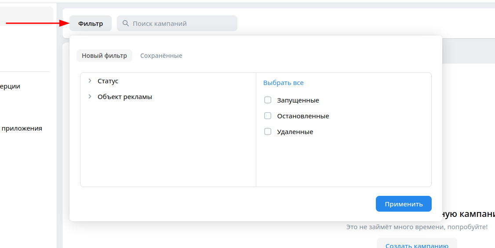
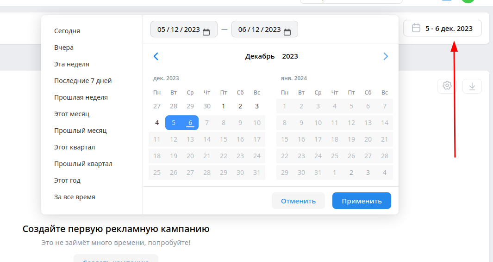
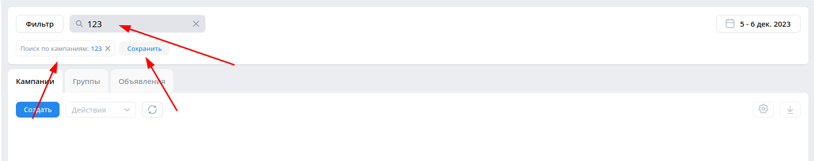
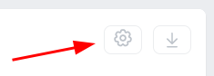
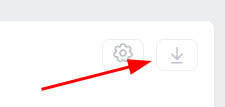
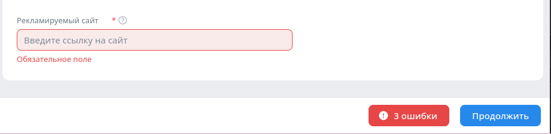
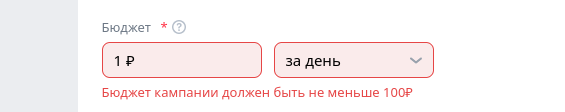
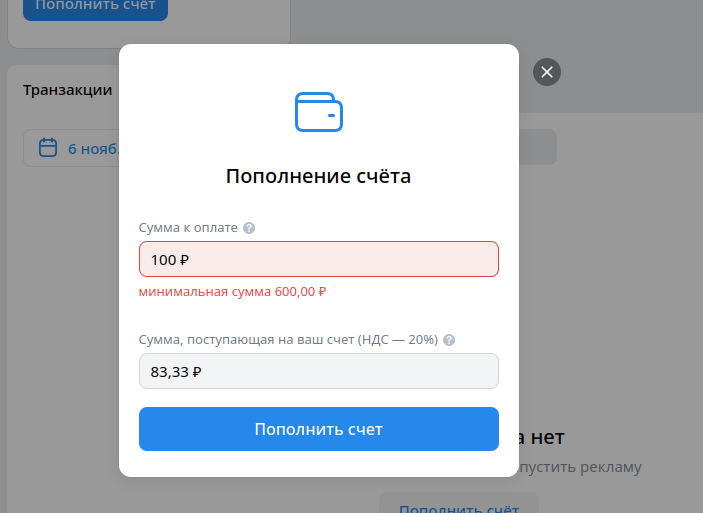
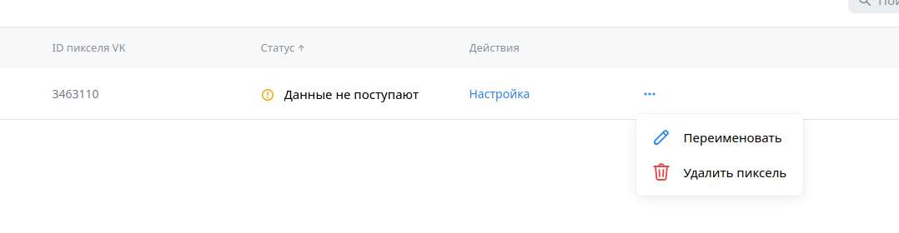
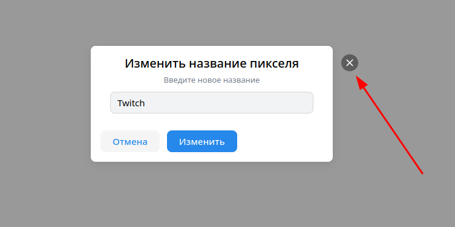

# Домашнее задание №3 по курсу "Обеспечение качества ПО" проекта VK Образование

## Команда: **PracticalDev**

**Почта:** test_ads_vk@mail.ru

**Пароль:** -

## Кампании

**URL:** https://ads.vk.com/hq/dashboard/ad_plans

- Кампании. Навигация по вкладкам. При нажатии на вкладку "Группы" происходит редирект на https://ads.vk.com/hq/dashboard/ad_groups
- Кампании. Навигация по вкладкам. При нажатии на вкладку "Объявления" происходит редирект на https://ads.vk.com/hq/dashboard/ads
- Кампании. Навигация по вкладкам. При нажатии на вкладку "Кампании" происходит редирект https://ads.vk.com/hq/dashboard/ad_plans
- Кампании. Топбар. При нажатии на кнопку "Фильтр" открывается модальное окно с фильтрами
  
- Кампании. Топбар. При нажатии на кнопку для установки диапазона дат появляется элемент календаря
  
- Кампании. Топбар. При внесении символов в поле поиска в нижней части топбара появляется отметка "Поиск по группам: " с введенными символами и кнопка "Сохранить"
  
- Кампании. Вкладка "Кампании". При отсутствии кампаний кнопка настроек не активна.
  
- Кампании. Вкладка "Кампании". При отсутствии кампаний кнопка загрузки не активна.
  
- Кампании. Вкладка "Кампании". При нажатии на кнопку "Создать" происходит редирект на https://ads.vk.com/hq/new_create/ad_plan

## Создание кампании

**URL:** https://ads.vk.com/hq/new_create/ad_plan

- Создание кампании. Настройка кампании. Топбар. При нажатии на название кампании оно становится доступным для изменения.
- Создание кампании. Настройка кампании. Топбар. При нажатии на кнопку дополнительных опций, появляется список дополнительных опций.
  
- Создание кампании. Настройка кампании. Целевые действия. Сайт. Футер. При нажатии на кнопку "Продолжить" с незаполненным полем "Рекламируемый сайт" полями появляется уведомление он наличие ошибок.
  
- Создание кампании. Настройка кампании. Целевые действия. Сайт. Оптимизация бюджета кампании. При вводе числа < 100 в поле "Бюджет" появляется сообщение "Бюджет кампании должен быть не меньше 100₽"
  
- Создание кампании. Настройка кампании. Целевые действия. Сайт. Оптимизация бюджета кампании. Минимальная цена. При вводе числа < 100 в поле "Бюджет" появляется сообщение "Бюджет кампании должен быть не меньше 100₽"
- Создание кампании. Настройка кампании. Целевые действия. Сайт. Оптимизация бюджета кампании. Предельная цена. Длинна ввода предельной цены ограничена 13 символами
- Создание кампании. Группы объявлений. При нажатии кнопки "Продложить" при этом не выбрав ни одного региона показа, в футере появляется сообщение об ошибке
- Создание кампании. Группы объявлений. Регионы показа. При выборе региона он отображается в списке выбранных
- Создание кампании. Группы объявлений. Демография. Возраст. При установлении нижней границы нельзя установить верхную границу меньше нижней
- Создание кампании. Группы объявлений. Устройства. При отключении одного из типов устройств невозможно отключить второй тип
- Создание кампании. Группы объявляений. Параметры URL. Добавлять UTM-метки вручную. При не указании параметров разметки и нажатии на кнопку "Продолжить" под полем ввода параметром разметки появляется сообщение "Обязательное поле".
- Создание кампании. Группы объявляений. Параметры URL. Добавлять UTM-метки вручную. При указании параметров разметки в некорректно виде([описание корректных меток](https://ads.vk.com/en/help/articles/utm))
- Создание кампании. Группы объявлений. Места размещения. При отключении опции "Автоматический выбор мест размещения " появляется список с местами для размещения.
- Создание кампании. Группы объявлений. Места размещения. Список мест размещения. При отключении всех мест размещения кроме одного, невозможно отключить включенное место.
- Создание кампании. Объявления. Топбар. При нажатии на название объявления оно становится доступным для изменения.
- Создание кампании. Объявления. При нажатии на кнопку "Опубликовать" при незаполненном поле "Заголовок" под этим полем появляется сообщение "Обязательное поле"
- Создание кампании. Объявления. При нажатии на кнопку "Опубликовать" при незаполненном поле "Короткое описание" под этим полем появляется сообщение "Обязательное поле"
- Создание кампании. Объявления. При заполении поля "Загловок" более чем 40 символами под этим поле появляется сообщение "Превышена максимальная длина поля"
- Создание кампании. Объявления. При заполении поля "Короткое описание" более чем 90 символами под этим поле появляется сообщение "Превышена максимальная длина поля"
- Создание кампании. Объявления. При заполении поля "Длинное описание" более чем 90 символами под этим поле появляется сообщение "Превышена максимальная длина поля"
- Создание кампании. Объявления. При заполении поля "Текст рядом с кнопкой" более чем 30 символами под этим поле появляется сообщение "Превышена максимальная длина поля"
- Создание кампании. Объявления. При заполении поля "Данные рекламодателя" более чем 30 символами под этим поле появляется сообщение "Превышена максимальная длина поля"
- Создание кампании. Объявления. При указании в поле "Ссылка на сайт" текста не являющегося корректным URL под эти полем появляется сообщение "Неверный формат URL"

## Бюджет

**URL:** https://ads.vk.com/hq/budget/

- Бюджет. Транзакции. При нажатии на кнопку "Пополнить budget_pageсчёт" открывается модальное окно с формой пополнения счёта.
  
- Бюджет. Транзации. При нажатии на кнопку установки диапазона дат появляется элемент календаря.
  
- Бюджет.Пополнение счета. При вводе в поле "Сумма к оплате" числа < 600 под полем ввода "Cумма к оплате" появляется надпись "минимальная сумма 600,00 ₽"
  
- Бюджет. Пополнение счета. При вводе в поле "Сумма, поступающая на ваш счет (НДС — 20%)" числа < 500 и попытке пополнить счет, "Cумма к оплате" появляется надпись "минимальная сумма 600,00 ₽"
  
- Бюджет. Пополнение счета. При вводе в поле "Сумма к оплате" числа, в поле "Сумма, поступающая на ваш счет (НДС — 20%)" появялется число равное 5/6 от введенного
- Бюджет. Пополнение счета. При вводе в поле "Сумма, поступающая на ваш счет (НДС — 20%)" числа, в поле "Сумма к оплате" появялется число равное 120% от введенного
- Бюджет. Пополнение счета. При вводе в поле "Сумма к оплате" числа >= 600 и нажатии на кнопку "Пополнить счёт" происходит переход на форму выбора способа оплаты
- Бюджет. Пополнение счета. При вводе в поле "Сумма, поступающая на ваш счет (НДС — 20%)" числа >= 500 и нажатии на кнопку "Пополнить счёт" происходит переход на форму выбора способа оплаты

## Сайты

**URL:** https://ads.vk.com/hq/pixels

- Сайты. При нажатии на кнопку "Добавить пиксель" появляется модальное окно добавления новго пикселя.
- Сайты. Модальное окно добавления пикселя. При нажатии на вкладку "Домен сайта" открывается форма с вводом домена сайта.
- Сайты. Модальное окно добавления пикселя. При нажатии на вкладку "ID пикселя" открывается форма с полями "ID пикселя", "Email владельца".
- Сайты. Модальное окно добавления пикселя. Домен сайта. При вводе некорректного домена сайта и нажатии на кнопку "Добавить пиксель" под полем ввода появляется сообщение "Введите корректный адрес сайта (вида: example.ru)"
- Сайты. Модальное окно добавления пикселя. ID пикселя. При пустых полях "ID пикселя" и "Email владельца" кнопка "Запросить доступ" заблокированна
- Сайты. Модальное окно добавления пикселя. Домен сайта. При заполнении поля "Домен сайта" корректным доменом и нажатии на кнопку "Добавить пиксель" создаётся пиксель с введённым доменом.
- Сайты. При нажатии на кнопку "..." появляется меню действий
  
- Сайты. Модальное окно изменения названия пикселя. При нажатии на кнопку "Отмена" модальное окно закрывается
- Сайты. Модальное окно изменения названия пикселя. При нажатии на кнопку "Изменить" модальное окно закрывается
- Сайты. Модальное окно изменения названия пикселя. При нажатии на кнопку закрытия модального окна модальное окно закрывается
  
- Сайты. Модальное окно изменения названия пикселя. При удалении всего текста из поля нового названия кнопка "Изменить" становится неактивной
