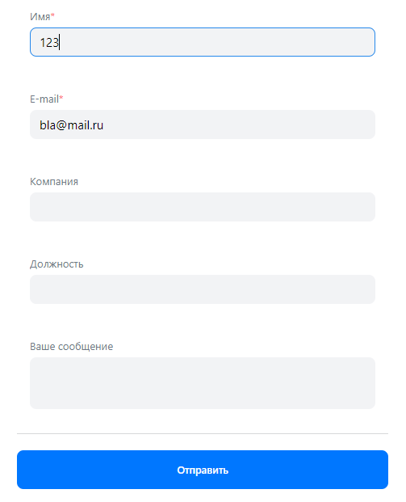

# Проект VK Реклама

---

## Регистрация кабинета ([https://ads.vk.com/hq/registration/new](https://ads.vk.com/hq/registration/new))

1. Регистрация кабинета. При выборе типа аккаунта "Агентство" доступен только тип аккаунта "Физическое лицо".
2. Регистрация кабинета. При выборе страны "Россия" доступные валюты - "Российский рубль (RUB)".
3. Регистрация кабинета. Ошибка при незаполненном поле Email.
4. Регистрация кабинета. Ошибка при длине Email >= 256 символов.
5. Регистрация кабинета. Ошибка при непринятом пользовательском соглашении.
6. Регистрация кабинета. Кнопка "Создать кабинет" редиректит на https://ads.vk.com/hq/dashboard при вводе Email верного
   формата (test@mail.ru) и принятом пользовательском соглашении.

---

## Аудитории ([https://ads.vk.com/hq/audience](https://ads.vk.com/hq/audience))

### Навигация по вкладкам

1. Аудитории. Клик на вкладку "Аудитории" редиректит на https://ads.vk.com/hq/audience/
2. Аудитории. Клик на вкладку "Списки пользователей" редиректит на https://ads.vk.com/hq/audience/user_lists

### Создание аудитории

1. Аудитории. При нажатии на кнопку "Создать аудиторию" открывается выпадающее справа окно создания аудитории.
2. Аудитории. Окно создания аудитории. Если не добавлено ни одного источника, то кнопка "Сохранить" неактивна.
3. Аудитории. Окно создания аудитории. Если хотя бы один источник добавлен, то кнопка "Сохранить" активна и клик по ней
   приводит к созданию аудитории.
4. Аудитории. Окно создания аудитории. Клик на кнопку "Добавить источник" открывает выпадающее окно с выбором источника.
5. Аудитории. Окно создания аудитории. Окно выбора источника. Отображается список со следующими категориями источников:
    - "Существующая аудитория"
    - "Список пользователей"
    - "События в мобильном приложении"
    - "Ключевые фразы"
    - "События на сайте"
    - "Подписчики сообществ"
    - "Рекламные кампании"
    - "События в лид-форме"
    - "Музыканты".

   Тестирование создания источника будет проведено с категорией источников "Ключевые фразы".
6. Аудитории. Окно создания аудитории. Окно выбора источника. Ключевые фразы. При пустых полях "Ключевые фразы" и
   "Минус-фразы" кнопка "Сохранить неактивна".
7. Аудитории. Окно создания аудитории. Окно выбора источника. Ключевые фразы. При заполнении только поля "Ключевые
   фразы" и клике на кнопку "Сохранить" происходит сохранение источника.
8. Аудитории. Окно создания аудитории. Окно выбора источника. Ключевые фразы. При пустом поле "Ключевые фразы" и клике
   на кнопку "Сохранить" появляется сообщение "Обязательное поле" под полем "Ключевые фразы".
9. Аудитории. Окно создания аудитории. Окно выбора источника. Ключевые фразы. При заполнении всех полей и клике на
   кнопку "Сохранить" происходит сохранение источника.

### Удаление аудитории

1. Аудитории. Список аудиторий. При нажатии на кнопку "..." открывается список с дополнительными действиями.

   

2. Аудитории. Список аудиторий. Дополнительные действия. При нажатии на кнопку "Удалить" аудитория удаляется.

---

## Настройки ([https://ads.vk.com/hq/settings](https://ads.vk.com/hq/settings))

### Навигация по вкладкам

1. Настройки. Клик на вкладку "Общие" редиректит на https://ads.vk.com/hq/settings
2. Настройки. Клик на вкладку "Уведомления" редиректит на https://ads.vk.com/hq/settings/notifications
3. Настройки. Клик на вкладку "Права доступа" редиректит на https://ads.vk.com/hq/settings/access
4. Настройки. Клик на вкладку "История изменений" редиректит на https://ads.vk.com/hq/settings/logs

### Вкладка "Общие"

1. Настройки. Общие. При нажатии на кнопку "Отменить" все поля возвращаются в исходное (сохраненное ранее) значение.
2. Настройки. Общие. При нажатии на кнопку "Сохранить" все поля сохраняются.

#### Контакты

1. Настройки. Общие. Контакты. Ошибка при вводе букв в поле "Телефон".
2. Настройки. Общие. Контакты. Ошибка при пустом поле "Телефон".

#### Реквизиты

1. Настройки. Общие. Реквизиты. Ошибка при пустом поле "ФИО".
2. Настройки. Общие. Реквизиты. Ошибка при вводе цифр в поле "ФИО".
3. Настройки. Общие. Реквизиты. Ошибка при пустом поле "ИНН".
4. Настройки. Общие. Реквизиты. Ошибка при вводе менее 12 цифр в поле "ИНН".
5. Настройки. Общие. Реквизиты. Ошибка при вводе букв в поле "ИНН".

### Вкладка "Уведомления"

1. Настройки. Уведомления. Способы получения. При выключении появляется баннер, указывающий на выключенные уведомления.
2. Настройки. Уведомления. Новости и акции. Все чек-боксы можно включить/отключить при включенных уведомлениях.
3. Настройки. Уведомления. Новости и акции. Все чек-боксы неактивны для изменения при выключенных уведомлениях.
4. Настройки. Уведомления. При нажатии на кнопку "Сохранить" все изменения сохраняются.

---

## Футер ([https://ads.vk.com](https://ads.vk.com))

1. Футер. Клик на логотип "VK Реклама" открывает страницу https://ads.vk.com
2. Футер. По кнопке "Перейти в кабинет" открывается страница с формой для входа на платформу https://id.vk.com.

### Разделы

1. Футер. Разделы. Клик по "Новости" редиректит на https://ads.vk.com/news
2. Футер. Разделы. Клик по "Полезные материалы" редиректит на https://ads.vk.com/insights
3. Футер. Разделы. Клик по "Мероприятия" редиректит на https://ads.vk.com/events
4. Футер. Разделы. Клик по "Документы" редиректит на https://ads.vk.com/documents
5. Футер. Разделы. Клик по "Обучение для бизнеса" редиректит на https://expert.vk.com
6. Футер. Разделы. Клик по "Кейсы" редиректит на https://ads.vk.com/cases
7. Футер. Разделы. Клик по "Помощь" редиректит на https://ads.vk.com/help
8. Футер. Разделы. Клик по "Монетизация" редиректит на https://ads.vk.com/partner

### Нижняя часть

1. Футер. Нижняя часть. Клик на логотип "ВК бизнес" редиректит на https://vk.company/ru/company/business
2. Футер. Нижняя часть. Клик на логотип "ВК" открывает страницу https://vk.com/vk_ads
3. Футер. Нижняя часть. Клик на логотип "Одноклассники" открывает страницу https://ok.ru/group/64279825940712
4. Футер. Нижняя часть. Клик на логотип "Телеграм" открывает страницу https://t.me/vk_ads
5. Футер. Нижняя часть. Элементы выпадающего списка "Язык" (RU|EN) меняют язык на выбранный
6. Футер. Нижняя часть. Клик на "О компании" редиректит на https://vk.company

---
