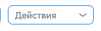
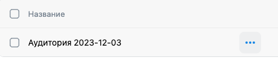

# Домашнее задание №3 по курсу "Обеспечение качества"

> Проект [VK Реклама](https://ads.vk.com)

> Авторизационные данные 
> 
> **Логин:** testadsvkcom@mail.ru
> 
> **Пароль:** [уточнить в лс]

## Общая навигация (с авторизацией)

> Главная страница: https://ads.vk.com/hq

- Главная страница. Клик на кнопку "Кампании" редиректит на https://ads.vk.com/hq/dashboard/ad_plans
- Главная страница. Клик на кнопку "Аудитории" редиректит на https://ads.vk.com/hq/audience
- Главная страница. Клик на кнопку "Бюджет" редиректит на https://ads.vk.com/hq/budget/transactions
- Главная страница. Клик на кнопку "Центр коммерции" редиректит на https://ads.vk.com/hq/ecomm/catalogs
- Главная страница. Клик на кнопку "Сайты" редиректит на https://ads.vk.com/hq/pixels
- Главная страница. Клик на кнопку "Мобильные приложения" редиректит на https://ads.vk.com/hq/apps
- Главная страница. Клик на кнопку "Лид-формы" редиректит на https://ads.vk.com/hq/leadads/leadforms
- Главная страница. Клик на кнопку "Настройки" редиректит на https://ads.vk.com/hq/settings
  
## Кампании (с авторизацией)

> Главная страница: https://ads.vk.com/hq/dashboard/ad_plans

### Навигация по разделам кампаний

- Кампании. Клик на кнопку "Кампании" редиректит на https://ads.vk.com/hq/dashboard/ad_plans
- Кампании. Клик на кнопку "Группы" редиректит на https://ads.vk.com/hq/dashboard/ad_groups
- Кампании. Клик на кнопку "Объявления" редиректит на https://ads.vk.com/hq/dashboard/ads

### Создание кампании (с авторизацией)

#### Настройки кампании

> https://ads.vk.com/hq/new_create/ad_plan

- Кампании. При нажатии на кнопку "Создать" редиректит на https://ads.vk.com/hq/new_create/ad_plan
- Кампании. Форма создания кампании. Настройки кампании. Целевые действия. Можно выбрать одно из целевых действий: "Сайт", "Каталог товаров", "Мобильное приложение", "Сообщество и профиль", "Одноклассники", "Лид-формы", "VK Mini Apps", "Музыка", "Видео и трансляции", "Дзен"
    > Для тестирования выбирается "Сайт", так как это один из наиболее применяемых типов рекламы.
- Кампании. Форма создания кампании. Настройки кампании. Рекламируемый сайт. При вводе некорректной ссылки выводится ошибка "Неверный формат URL"
    > Критерий некорректной ссылки: не соотвествие регулярному выражению `^\w+\.\D{2,}$` (две части, которые разделены точкой, в первой части хотя бы одна буква или цифра, во второй части минимум две буквы)
- Кампании. Форма создания кампании. Настройки кампании. Рекламируемый сайт. При вводе корректной ссылки появляются дополнительные поля для ввода
    > Критерий корректной ссылки: соотвествие регулярному выражению `^\w+\.\D{2,}$` (две части, которые разделены точкой, в первой части хотя бы одна буква или цифра, во второй части минимум две буквы)
- Кампании. Форма создания кампании. Настройки кампании. Целевое действие. При нажатии появляется выпадающий список: "Показы рекламы" и "Клики по рекламе"
- Кампании. Форма создания кампании. Настройки кампании. Стратегия ставок. При нажатии появляется выпадающий список: "Предельная цена" и "Минимальная цена"
    > Для тестирования выбирается "Минимальная цена", так как она стоит по умолчанию, а большинство пользователей не меняют начальные настройки.
- Кампании. Форма создания кампании. Настройки кампании. Даты проведения. Можно выбрать дату начала, а дату конца оставить пустой
- Кампании. Форма создания кампании. Настройки кампании. При нажатии на кнопку "Продолжить" редиректит на https://ads.vk.com/hq/new_create/ad_plan/{campaign_id}/ad_group/{group_id}
  
#### Группы объявлений

> https://ads.vk.com/hq/new_create/ad_plan/{campaign_id}/ad_group/{group_id}

- Кампании. Форма создания кампании. Группы объявлений. Доступны для сворачивания/разворачивания разделы "Регионы показа", "Демография", "Интересы и поведение", "Пользовательские аудитории", "Устройства", "Параметры URL", "Места размещения"
- Кампании. Форма создания кампании. Группы объявлений. Регионы показа. Все чекбоксы ("Россия", "Бывший СССР", "Европа", "Азия", "Северная Америка", "Остальной мир", "Африка" "Австралия и Океания", "Латинская Америка", "Антарктика") можно включить/отключить 
- Кампании. Форма создания кампании. Группы объявлений. Все разделы кроме "Регионы показа" являются необязательными - без их заполнения можно нажать кнопку "Продолжить"
- Кампании. Форма создания кампании. Группы объявлений. При нажатии на кнопку "Продолжить" редиректит на https://ads.vk.com/hq/new_create/ad_plan/{campaign_id}/ad_group/{group_id}/ad/{id}

#### Объявления

> https://ads.vk.com/hq/new_create/ad_plan/{campaign_id}/ad_group/{group_id}/ad/{id}

- Кампании. Форма создания кампании. Объявления. Заголовок. При пустом поле ввода появляется ошибка "Обязательное поле"
- Кампании. Форма создания кампании. Объявления. Заголовок. При длине текста > 40 в поле ввода появляется ошибка "Превышена максимальная длина поля"
- Кампании. Форма создания кампании. Объявления. Короткое описание. При пустом поле ввода появляется ошибка "Обязательное поле"
- Кампании. Форма создания кампании. Объявления. Короткое описание. При длине текста > 40 в поле ввода появляется ошибка "Превышена максимальная длина поля"
- Кампании. Форма создания кампании. Объявления. Все поля кроме "Заголовок" и "Короткое описание" являются необязательными
- Кампании. Форма создания кампании. Объявления. При нажатии на кнопку "Опубликовать" редиректит на https://ads.vk.com/hq/dashboard/ad_plans, среди кампаний находится только что созданная 

### Удаление кампании

- Кампании. Список кампаний. При нажатии на чекбокс напротив названия кампании появляется блок действий
    
- Кампании. Список кампаний. Дополнительные действия. При нажатии на кнопку "Удалить" кампания удаляется

## Аудитории (с авторизацией)

> Главная страница: https://ads.vk.com/hq/audience/

### Навигация по разделам аудиторий

- Аудитории. Клик на кнопку "Аудитории" редиректит на https://ads.vk.com/hq/audience/
- Аудитории. Клик на кнопку "Списки пользователей" редиректит на https://ads.vk.com/hq/audience/user_lists

### Создание аудитории

- Аудитории. При нажатии на кнопку "Создать аудиторию" открывается выпадающее окно с созданием
- Аудитории. Окно создания аудитории. Если аудиторий нет, то невозможно нажать на кнопку "Сохранить"
- Аудитории. Окно создания аудитории. При нажатии на кнопку "Добавить источник" открывается выпадающее окно с выбором источника
- Аудитории. Окно создания аудитории. Окно выбора аудитории. В списке присутствуют следующие варианты: "Существующая аудитория", "Список пользователей", "События в мобильном приложении", "Ключевые фразы", "События на сайте", "Подписки сообществ", "Рекламные кампании", "События в лид-форме", "Музыканты"
    > Для тестирования выбирается "Ключевые фразы", так как это один из самых популярных видов таргетинга.
- Аудитории. Окно создания аудитории. Окно выбора аудитории. Ключевые фразы. Название. При пустом поле ввода невозможно нажать на кнопку "Сохранить"
- Аудитории. Окно создания аудитории. Окно выбора аудитории. Ключевые фразы. Ключевые фразы. При пустом поле ввода невозможно нажать на кнопку "Сохранить"
- Аудитории. Окно создания аудитории. Окно выбора аудитории. Ключевые фразы. Минус-фразы. При пустом поле ввода возможно нажать на кнопку "Сохранить"
- Аудитории. Окно создания аудитории. Окно выбора аудитории. Ключевые фразы. При нажатии на кнопку "Сохранить" выпадающее окно закрывается и введенная ключевая фраза появляется в списке условий
- Аудитории. Окно создания аудитории. Если аудитория есть, то возможно нажать на кнопку "Сохранить"
- Аудитории. Окно создания аудитории. Ключевые фразы. При нажатии на кнопку "Сохранить" среди аудиторий находится только что созданная 

### Удаление аудитории

- Аудитории. Список аудиторий. При нажатии на кнопку "..." открывается список с дополнительными действиями
    
- Аудитории. Список аудиторий. Дополнительные действия. При нажатии на кнопку "Удалить" аудитория удаляется

## Настройки (с авторизацией)

> Главная страница: https://ads.vk.com/hq/settings

### Навигация по разделам настроек

- Настройки. Клик на кнопку "Общие" редиректит на https://ads.vk.com/hq/settings
- Настройки. Клик на кнопку "Уведомления" редиректит на https://ads.vk.com/hq/settings/notifications
- Настройки. Клик на кнопку "Права доступа" редиректит на https://ads.vk.com/hq/settings/access
- Настройки. Клик на кнопку "История изменений" редиректит на https://ads.vk.com/hq/settings/logs

### Общие настройки

- Настройки. Общие. Контакты. Ошибка "Некорректный номер телефона" при вводе букв в поле "Телефон"
- Настройки. Общие. Контакты. Ошибка "Телефон не может быть короче 12 цифр" при пустом поле "Телефон"
- Настройки. Общие. Реквизиты. Ошибка "Обязательное поле" при пустом поле "ФИО"
- Настройки. Общие. Реквизиты. Ошибка "Обязательное поле" при пустом поле "ИНН"
- Настройки. Общие. Реквизиты. Ошибка "Некорректный ИНН" при вводе букв в поле "ИНН"
- Настройки. Общие. Реквизиты. Ошибка "Длина ИНН должна быть 12 символов" при вводе менее 12 цифр в поле "ИНН"
- Настройки. Общие. При нажатии на кнопку "Отменить" все поля очищаются
- Настройки. Общие. При нажатии на кнопку "Сохранить" информация сохраняется

### Настройки уведомлений

> https://ads.vk.com/hq/settings/notifications

- Настройки. Уведомления. Способы получения. При выключении появляется окно с заголовком "Уведомления выключены"
- Настройки. Уведомления. Новости и акции. Все чекбоксы ("Новости", "Мероприятия", "Акции, спецпредложения и прочие") можно включить/отключить
- Настройки. Уведомления. При нажатии на кнопку "Сохранить" все изменения сохраняются
