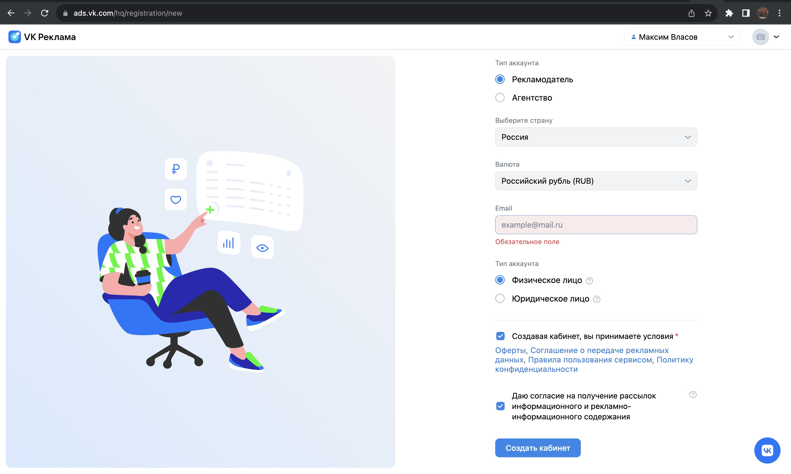
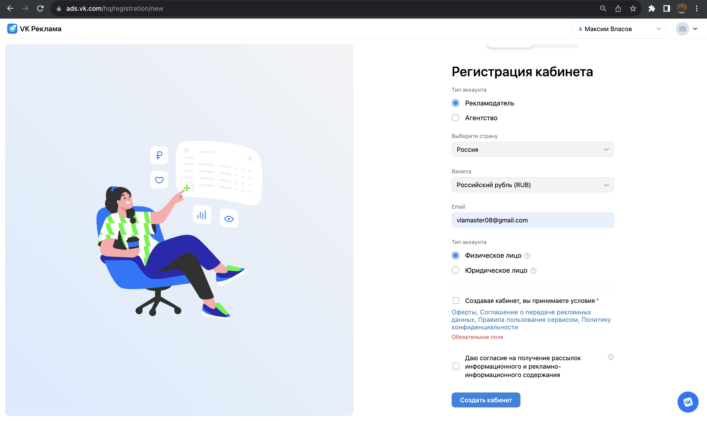
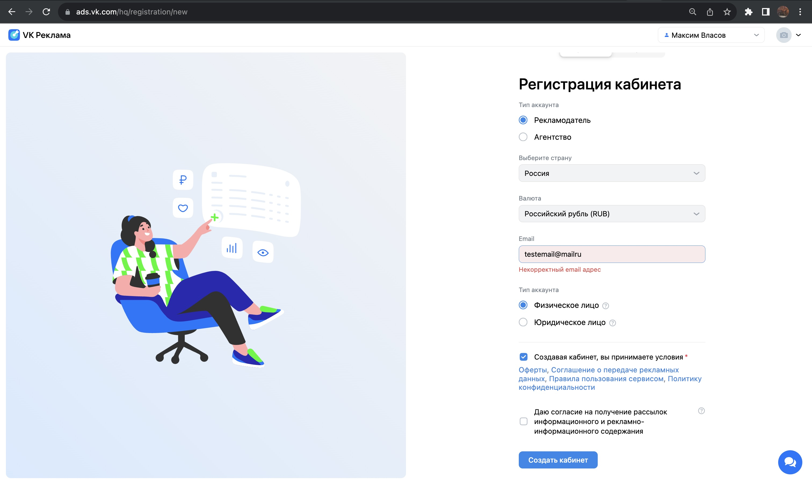

# Домашнее задание №3 по курсу "Обеспечение качества"

# Проект ["VK Реклама"](https://ads.vk.com)

## Авторизационные данные

Логин: <testadsvkcom@mail.ru>

Пароль: [уточнить в лс]

## Персональные данные

Имя: Тест

Фамилия: Тестов

## Навбар ( без авторизации )

1. Клик на кнопку "Новости" редиректит на <https://ads.vk.com/news>

2. Клик на кнопку "Кейсы" редиректит на <https://ads.vk.com/cases>

3. Клик на кнопку "Форум идей" редиректит на <https://ads.vk.com/upvote>

4. Клик на кнопку бренда "VK реклама" редиректит на главную <https://ads.vk.com>

5. При наведении на кнопку "Обучение" открывается выпадающий список

6. Элементы выпадающего списка: "Полезные материалы", "Мероприятия", "Видеокурсы", "Сертификация" редиректят на соответствующие страницы

7. Клик на кнопку "Монетизация" редиректит на <https://ads.vk.com/partner>, открытую в новой вкладке

8. Клик на кнопку "Справка" редиректит на <https://ads.vk.com/help>

9. Клик на кнопку "Перейти в кабинет" редиректит на <https://id.vk.com/auth>

## Регистрация пользователя

1. Клик на кнопку "Перейти в кабинет" редиректит на <https://id.vk.com/auth>

2. Клик на кнопку авторизации через mail.ru редиректит на <https://account.mail.ru/login>

3. После ввода логина и пароля, нажатия войти открывается окно запроса приложения "VK реклама" доступа к данным

4. Клик на кнопку разрешить редирекит на <https://ads.vk.com/hq/registration>

5. В блоке аккаунт написаны правильные имя и фамилия (Тест Тестов)

## Создание кабинета

1. Клик на кнопку "Создать новый кабинет" редиректит на <https://ads.vk.com/hq/registration/new>

2. При выборе типа аккаунта "Агенство" доступен лишь вариант выбора "Юридическое лицо"

3. Варианты возможных валют зависят от выбранной страны (Россия - RUB; Казахстан - USD, EUR; Беларусь -  USD, EUR)

4. При клике на кнопку "Создать кабинет" с незаполненным полем "Email" возникает ошибка "Обязательное поле"

5. При клике на кнопку "Создать кабинет" без прожатия чекбокса о принятии усовий возникает ошибка "Обязательное поле"

6. При вводе некорректного (который не соответсвует формату почты ([a-zA-Z0-9._-]+@[a-zA-Z0-9._-]+\.[a-zA-Z0-9_-]+) ) email возникает ошибка "Некорректный email адрес"

7. Клик на кнопку "Создать кабинет" редиректит на <https://ads.vk.com/hq/dashboard>
