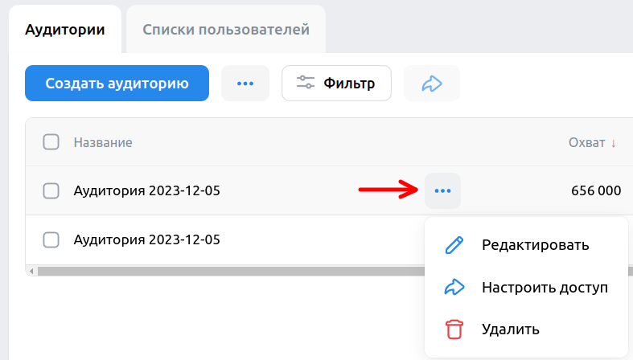

# Домашнее задание №3 по курсу "Обеспечение качества"

# Проект ["VK Реклама"](https://ads.vk.com)

## Справка - https://ads.vk.com/help

1. Справка. Кнопка "Авторизация" редирект на <https://ads.vk.com/help/categories/authorization>

2. Справка. Кнопка "Как настроить рекламу" редирект на <https://ads.vk.com/help/categories/general>

3. Справка. Кнопка "Документы" редирект на <https://ads.vk.com/help/categories/documents>

4. Справка. Кнопка "Статистика и финансы" редирект на <https://ads.vk.com/help/categories/statistics>

5. Справка. Кнопка "Инструменты рекламы" редирект на <https://ads.vk.com/help/categories/features>

6. Справка. Кнопка "Упрощенный кабинет" редирект на <https://ads.vk.com/help/categories/mini_ads>

7. Справка. Кнопка "FAQ" редирект на <https://ads.vk.com/help/categories/faq>

8. Справка. Кнопка "Кабинет партнера" редирект на <https://ads.vk.com/help/categories/partner>

## Футер

1. Футер. Кнопка "Перейти в кабинет" открывает <https://id.vk.com>

2. Футер. Клик на логотип "ВК бизнес" открывает <https://vk.company/ru/company/business>

3. Футер. Клик на "О компании" открывает <https://vk.company>

4. Футер. Элементы списка Разделы перенаправляют на соответствующие страницы 

5. Футер. Клик на логотип "ВК", "Одноклассники", "Telegram" открывает соответствующие сайты 

6. Футер. Элементы выпадающего списка "Язык" меняют языка на выбранный 

## Монетизация - https://ads.vk.com/partner

1. Монетизация. Кнопка "Перейти в кабинет" редирект на <https://ads.vk.com/hq/partner>

2. Монетизация. Кнопка "Справка" редирект на <https://ads.vk.com/help/categories/partner>

3. Монетизация. Выбор формата "Для сайтов" показывает следующие форматы: "Баннер", "Instagram", "Адаптивный блок", "InPage", "Полноэкранный блок"()

4. Монетизация. Выбор формата "Для приложений" показывает следующие форматы: "Баннер", "Нативный формат", "Полноэкранный блок", "Видео за вознаграждение"()

5. Монетизация. Форма обратной связи. При заполнении полей "Имя" и "Email" кнопка "Отправить" становится активной.()

6. Монетизация. Форма обратной связи. При отправке формы, появляется надпись "Спасибо, ваша заявка принята"()
