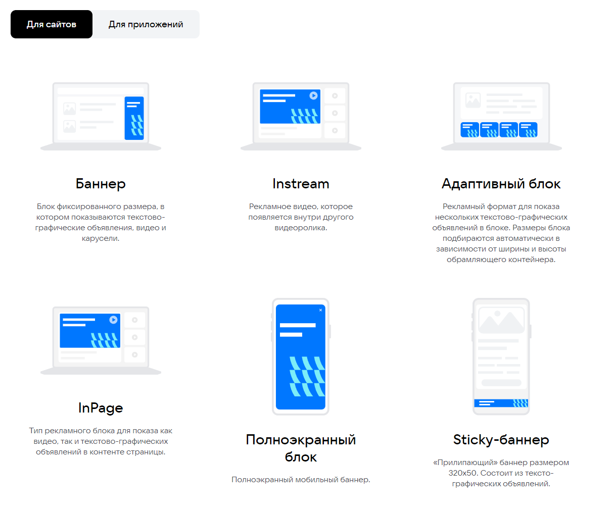

# Домашнее задание №3 по курсу "Обеспечение качества"

> Проект [VK Реклама](https://ads.vk.com)

> Авторизационные данные 
> 
> **Логин:** testadsvkcom@mail.ru
> 
> **Пароль:** [уточнить в лс]

## Справка (без авторизации) 

> Главная страница: https://ads.vk.com/help

- Справка. Кнопка "Авторизация" редирект на <https://ads.vk.com/help/categories/authorization>
- Справка. Кнопка "Как настроить рекламу" редирект на <https://ads.vk.com/help/categories/general>
- Справка. Кнопка "Документы" редирект на <https://ads.vk.com/help/categories/documents>
- Справка. Кнопка "Статистика и финансы" редирект на <https://ads.vk.com/help/categories/statistics>
- Справка. Кнопка "Инструменты рекламы" редирект на <https://ads.vk.com/help/categories/features>
- Справка. Кнопка "Упрощенный кабинет" редирект на <https://ads.vk.com/help/categories/mini_ads>
- Справка. Кнопка "FAQ" редирект на <https://ads.vk.com/help/categories/faq>
- Справка. Кнопка "Кабинет партнера" редирект на <https://ads.vk.com/help/categories/partner>

## Футер (без авторизации)

> Главная страница: https://ads.vk.com

- Футер. Кнопка "Перейти в кабинет" открывает <https://id.vk.com>
- Футер. Клик на логотип "ВК бизнес" открывает <https://vk.company/ru/company/business>
- Футер. Клик на "О компании" открывает <https://vk.company>
- Футер. Элементы списка Разделы перенаправляют на соответствующие страницы 
- Футер. Клик на логотип "ВК", "Одноклассники", "Telegram" открывает соответствующие сайты 
- Футер. Элементы выпадающего списка "Язык" меняют языка на выбранный 

## Монетизация (без авторизации)

> Главная страница: https://ads.vk.com/partner

- Монетизация. Выбор формата "Для сайтов" показывает следующие форматы: "Баннер", "Instagram", "Адаптивный блок", "InPage", "Полноэкранный блок". 
- Монетизация. Выбор формата "Для приложений" показывает следующие форматы: "Баннер", "Нативный формат", "Полноэкранный блок", "Видео за вознаграждение". 
- Монетизация. Форма обратной связи. При заполнении валидных полей "Имя" и "Email" кнопка "Отправить" становится активной. 
- Монетизация. Форма обратной связи. При отправке формы, появляется надпись "Спасибо, ваша заявка принята". 
