# Домашнее задание №3 по курсу "Обеспечение качества"

# Проект ["VK Реклама"](https://ads.vk.com)

# Тестирование главной страницы

## Раздел - Футер главной страницы

# Тестирование личного кабинета

## Раздел - Центр коммерции

Центр коммерции. При нажатии на любую из двух кнопок “Создать каталог”, слева выезжает на часть вкладки окно нового каталога, часть, незаслонённая этим окном становится прозрачно серой

Центр коммерции. При нажатии на поиск и введении запроса выдаются каталоги, подходящие по названию.

Центр коммерции. При нажатии на  определённого каталога или его название, пользователь перенаправляется на вкладку каталога, например, <https://ads.vk.com/hq/ecomm/catalogs/334162>

### Подраздел - Новый каталог

Новый каталог. При пустом поле “Название” и попытке создать каталог или стирании всех символов после неудачной попытки создать каталог высвечивается ошибка “Обязательное поле”

    Новый каталог. При нажатии на кнопку “Создать каталог” при не добавленных позициях ничего не происходит. До момента выбора и заполнения одной из категорий добавлений позиций кнопка “Создать каталог” выглядит активной.

  

Новый каталог. Добавление позиций. При выборе “Фид или сообщество” появляются поля уточнения.

Новый каталог. Добавление позиций. Фид или сообщество. При добавлении ссылки на группу ВКонтакте, в которой меньше трёх товаров, и нажатии кнопки “Создать каталог”, окно подсвечивается красным и высвечивается ошибка “В выбранном сообществе недостаточно товаров”.

Новый каталог. Добавление позиций. Фид или сообщество. При добавлении текста, не являющегося ссылкой и нажатии кнопки “Создать каталог”, окно подсвечивается красным и высвечивается ошибка “Необходимо указать протокол http(s)”.

Новый каталог. Добавление позиций. Фид или сообщество. При наведении на  рядом с “Ввести логин и пароль” появляется иконка пояснения.

Новый каталог. Добавление позиций. Фид или сообщество. При нажатии на кнопку “Ввести логин и пароль” появляются поля ввода логина и пароля.

Новый каталог. Добавление позиций. Фид или сообщество. При вводе первой буквы логина появляется поле “Автоматически удалять UTM-метки”

Новый каталог. Добавление позиций. Фид или сообщество. При нажатии на поле  , оно меняется на 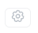.

Новый каталог. Добавление позиций. Фид или сообщество. При наведении на поле “Автоматически удалять UTM-метки”, оно выделяется серым.

Новый каталог. Добавление позиций. Фид или сообщество. При неверной ссылке или вводе логина и пароля, хотя их там нет, и попытке создать каталог, окно подсвечивается красным и высвечивается ошибка “Неверный формат файла”.

Новый каталог. Добавление позиций. При выборе “Маркетплейс” появляются поля уточнения.

Новый каталог. Добавление позиций. Маркетплейс. При вводе ссылки на страницу продавца появляются поля уточнения и инструкция в зависимости от маркетплейса. При вводе некорректной ссылки и нажатии на “Создать каталог”, окно подсвечивается красным и высвечивается ошибка.

Новый каталог. Добавление позиций. Маркетплейс. Для Wildberries. При наведении на
“в личном кабинете продавца”, надпись подчёркивается, при клике на неё происходит редирект на “<https://seller.wildberries.ru/login/”>

Новый каталог. Добавление позиций. Маркетплейс. Для Wildberries. При наведении на “подробнее об API продавца”, надпись подчёркивается, при клике на неё происходит редирект на “<https://openapi.wildberries.ru/”>

Новый каталог. Добавление позиций. Маркетплейс. Для Wildberries. При введении неверного значения в поле “Api key”, окно подсвечивается красным и высвечивается ошибка “Указан неверный ключ” и в левом нижнем углу выезжает окошко 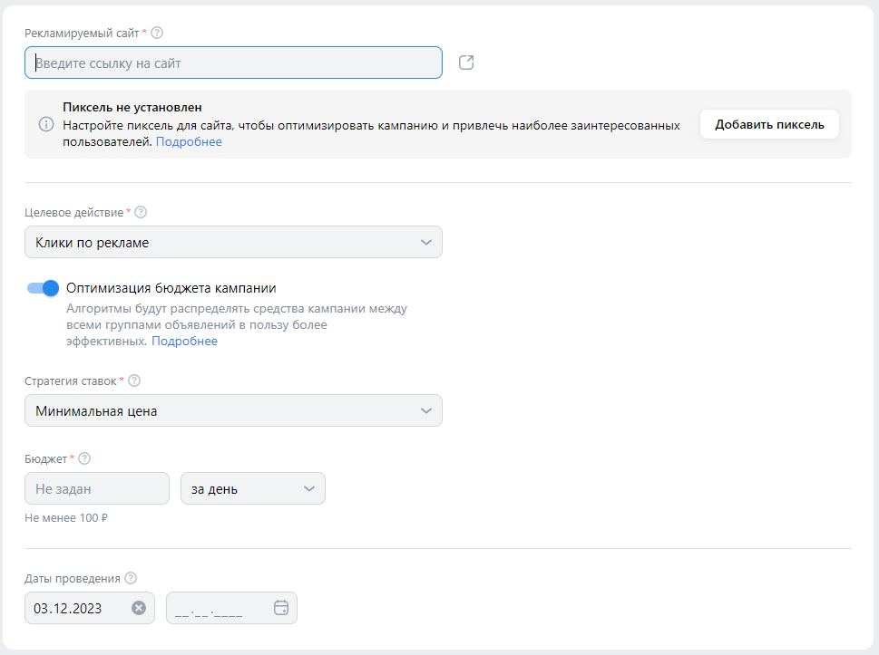 . Если окошко остаётся пустым. Если присутствуют знаки, которые не могут быть в этом окне, окно подсвечивается красным и выводится сообщение “String is not compatible with encoding” и в левом нижнем углу выезжает окошко 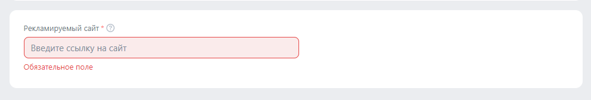. Уведомление за серым экраном.

Новый каталог. Добавление позиций. Маркетплейс. Для Aliexpress. При наведении на “API-токенов”, надпись подчёркивается, при клике на неё происходит редирект на “<https://business.aliexpress.ru/docs/api-token”>

Новый каталог. Добавление позиций. Маркетплейс. Для Aliexpress. При наведении на “Подробнее об API продавца”, надпись подчёркивается, при клике на неё происходит редирект на “<https://business.aliexpress.ru/docs/quick-start#heading-shagi-dlya-integratsii-s-lokalnim-api”>

Новый каталог. Добавление позиций. Маркетплейс. Для Aliexpress. При введении неверного значения в поле “Токен api”, окно подсвечивается красным и высвечивается ошибка “Указан неверный ключ” и в левом нижнем углу выезжает окошко 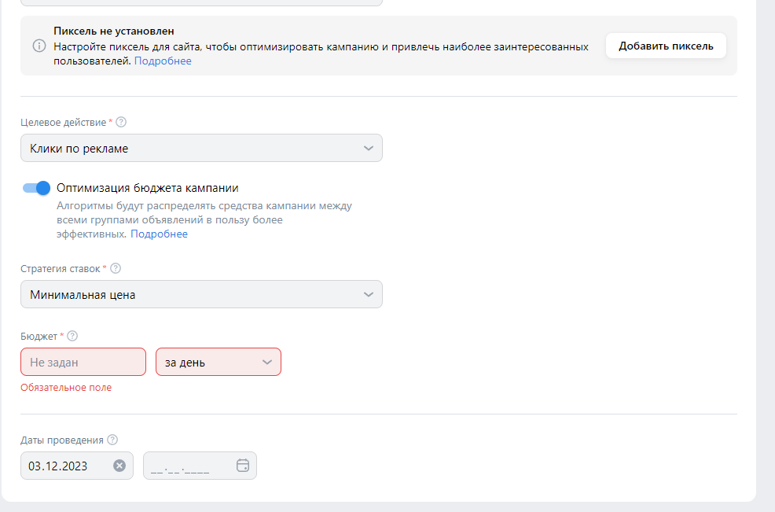 . Если окошко остаётся пустым. Если присутствуют знаки, которые не могут быть в этом окне, окно подсвечивается красным и выводится сообщение “String is not compatible with encoding” и в левом нижнем углу выезжает окошко 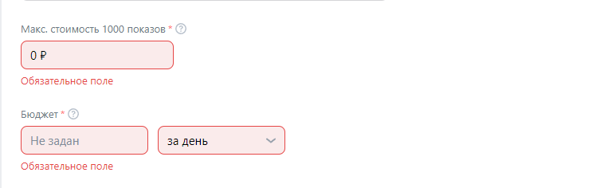. Уведомление за серым экраном.

Новый каталог. Добавление позиций. Маркетплейс. Для OZON. При наведении на “в личном кабинете продавца”, надпись подчёркивается, при клике на неё происходит редирект на “<https://seller.ozon.ru/app/registration/signin?redirect=L3NldHRpbmdzL2FwaS1rZXlz”>

Новый каталог. Добавление позиций. Маркетплейс. Для OZON. При наведении на “Инструкция по созданию ключа”, надпись подчёркивается, при клике на неё происходит редирект на “<https://seller-edu.ozon.ru/api-ozon/how-to-api”>

Новый каталог. Добавление позиций. Маркетплейс. Для OZON. При изменении автоматически подобранного “Client id” ничего не происходит.

Новый каталог. Добавление позиций. Маркетплейс. Для OZON. При введении неверного значения в поле “Api key”, окно подсвечивается красным и высвечивается ошибка “Указан неверный ключ” и в левом нижнем углу выезжает окошко 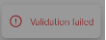 . Если окошко остаётся пустым. Если присутствуют знаки, которые не могут быть в этом окне, окно подсвечивается красным и выводится сообщение “String is not compatible with encoding” и в левом нижнем углу выезжает окошко 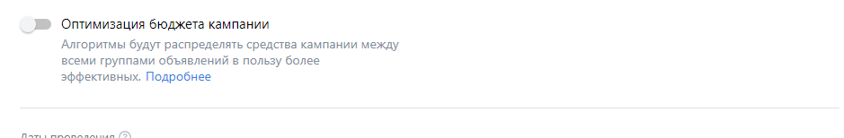 .  Уведомление за серым экраном. 

Новый каталог. Добавление позиций. Маркетплейс. Для Яндекс.Маркета. При нажатии на “Предоставить доступ” происходит редирект на “<https://passport.yandex.ru/auth/welcome?retpath=https%3A%2F%2Foauth.yandex.ru%2Fauthorize%3Fresponse_type%3Dcode%26client_id%3Dca3912e523ca4a6a9b5a8573388a0580%26force_confirm%3Dyes%26redirect_uri%3Dhttps%3A%2F%2Fads.vk.com%2Fapi%2Fcallbacks%2Fyamarket-complete&noreturn=1&origin=oauth”>

Новый каталог. Добавление позиций. Фид или сообщество и Маркетплейс. При нажатии на   в поле “Период обновление” раскрывается меню выбора периода. При выборе изменяется значение поля периода.

Новый каталог. Добавление позиций. При выборе “Вручную” появляются поля уточнения.

Новый каталог. Добавление позиций. Вручную. При нажатии на 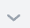 в поле “Категория фида” раскрывается меню выбора категории. При клике на категорию не изменяется значение поля категории фида и не переставляется галочка с категории “Товары”. В зависимости от выбранной категории изменяется кнопка скачивания. 

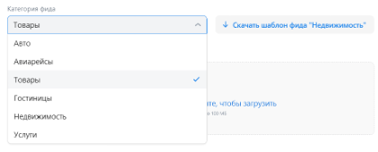

Скрин при клике на категорию “Недвижимость”. При этом невозможно снова нажать на
  категорию “Товары”, чтобы был показан в скачивании шаблон товаров.

Новый каталог. Добавление позиций. Вручную. При нажатии на кнопку “Скачать шаблон фида “категория”” скачивается шаблон категории, указанной в названии кнопки.

Новый каталог. Добавление позиций. Вручную. При нажатии на поле загрузки файла открывается вкладка выбора файла. При выборе файла двойным щелчком или перетаскивании его на окно загрузки файла, происходит загрузка файла. При попытке перетащить файл расширения pdf, он не загружается. При загрузке файла, который не подходит по структуре в левом нижнем углу выезжает уведомление [Alt text](image-14.png). Уведомление за серым экраном.

Новый каталог. Добавление позиций. Вручную. При нажатии на поле 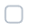, оно меняется на .

Новый каталог. Добавление позиций. Вручную. При наведении на поле “Автоматически удалять UTM-метки”, оно выделяется серым.

Новый каталог. При нажатии на кнопку “создать каталог” любого из каталогов переходит на вкладку каталога и каталог появляется в списке каталогов на странице “Центр коммерции”.

Новый каталог. При нажатии на кнопку “Отмена” или нажатии на серую часть экрана производится выход из этого окна обратно в “Центр коммерции”

### Подраздел – вкладка каталога

Вкладка каталога. При нажатии на   в поле названия каталога раскрывается меню выбора каталогов. При выборе изменяется значение поля.

Вкладка каталога. Автоматически видна вкладка “Товары”. По кнопке “Товары” на вкладку каталога, например,  <https://ads.vk.com/hq/ecomm/catalogs/334162>

Вкладка каталога. При нажатии на кнопку “Группы”, происходит редирект на “<https://ads.vk.com/hq/ecomm/catalogs/334162/groups”>

Вкладка каталога. При нажатии на кнопку “Диагностика”, происходит редирект на “<https://ads.vk.com/hq/ecomm/catalogs/334162/diagnostics”>

Вкладка каталога. При нажатии на кнопку “События”, происходит редирект на “<https://ads.vk.com/hq/ecomm/catalogs/334162/event”>

Вкладка каталога. При нажатии на кнопку “История загрузок”, происходит редирект на “<https://ads.vk.com/hq/ecomm/catalogs/334162/history”>

Вкладка каталога. Товары. При нажатии на кнопку “Рекламировать”, происходит редирект на “<https://ads.vk.com/hq/new_create/ad_plan?catalogId=334162&objectiveGroup=ecomm”>

Вкладка каталога. Товары. При использовании поиска выдаются товары только по названию и ID, в остальных столбцах поиск не осуществляется.

Вкладка каталога. Товары. При нажатии на кнопки  открывается окно настроек таблицы.

Вкладка каталога. Товары. Настройки таблицы. При поиске выдаются подпункты из пунктов “Информация” и “Основные метрики”

Вкладка каталога. Товары. Настройки таблицы. При изменении настроек и нажатии кнопки “Применить” таблица не изменяется. Настройки применятся только в случае обновления страницы вручную.
   

Вкладка каталога. Товары. При нажатии на название товара справа выезжает окна на часть вкладки с описанием товара и ссылкой.

Вкладка каталога. Товары. Описание товара. При клике на ссылку происходит редирект на оригинальную страницу товара.

Вкладка каталога. Товары. Описание товара. При клике на 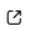  происходит редирект на страницу конкретной фотографии.

Вкладка каталога. Товары. При нажатии на кнопку  рядом с названием товара она изменяется на   и 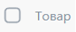 изменяется на 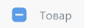.

Вкладка каталога. Товары. При нажатии на  она изменяется на 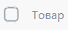 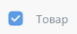 и все  около товаров становятся .

Вкладка каталога. Товары. При наведении на   появляется комментарий  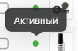.

Вкладка каталога. Товары. При наведении на ячейку справа от надписи “Товар”   появляется 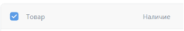 , а также справа от “Цена” 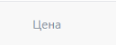 появляется 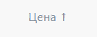.

Вкладка каталога. Товары. При нажатии на   происходит сортировка от меньшего к большему, при повторном нажатии   меняется на   и происходит сортировка от большего к меньшему

Вкладка каталога. При нажатии на  происходит переход на вкладку диагностики с фильтром “Предупреждения”.

Вкладка каталога. При нажатии на  происходит переход на вкладку диагностики с фильтром “Ошибки”.

Вкладка каталога. При нажатии на   справа выезжает вкладка настроек каталога.

Вкладка каталога. Группы. При нажатии на кнопку выпадает меню.

Вкладка каталога. Группы. Создать группу. При выборе “Использовать фильтры” справа выезжает окно создания группы.

Вкладка каталога. Группы. Создать группу. Использовать фильтры. При отсутствии названия поле подсвечивается красным и высвечивается ошибка “Обязательное поле”.

Вкладка каталога. Группы. Создать группу. При попытке создать группу с именем, которое уже есть, в левом нижнем углу появляется уведомление   Уведомление за серым фоном.

Вкладка каталога. Группы. Создать группу. Использовать фильтры. При нажатии на кнопку   выпадает меню с выбором категории или условия.

Вкладка каталога. Группы. Создать группу. Использовать фильтры. При вводе какого-то числа в поле “Значение”    и стирания всех его цифр, через небольшое время первая цифра числа появляется обратно  . Фильтрация возникает сразу при вводе числа.

Вкладка каталога. Группы. Создать группу. Использовать фильтры.

Вкладка каталога. Группы. При нажатии кнопки “Добавить фтльтр”, добавляются поля фильтра. Фильтр применяется.

Вкладка каталога. Группы. Создать группу. При выборе “Выбрать товары вручную” справа выезжает окно создания группы.

Вкладка каталога. Группы. Создать группу. Выбрать товары вручную. Поиск происходит по названию или ID товара, по другим критериям не ищет.

Вкладка каталога. Группы. Создать группу. Выбрать товары вручную. При переходе на вкладку “Выбранные” отображаются товары, отмеченные   в “Выборе товаров”.

Вкладка каталога. Группы. При нажатии на созданную группу открывается список товаров, принадлежащий ей.

Вкладка каталога. Группы. Кнопка   неактивна ни в каком случае.

Вкладка каталога. Группы. При нажатии на   открывается окно создания группы с настройками, которые применены к группе.

Вкладка каталога. Группы. При нажатии на   появляется меню.

Вкладка каталога. Диагностика. При нажатии на   происходит скачивание файла отчёта.
Вкладка каталога. Диагностика. При нажатии кнопки “Проверить снова” происходит обновление в истории загрузок, но никакого уведомления о том, что кнопка сработала не поступает. При последующих наведениях на неактивную кнопку высвечивается сообщение.

Вкладка каталога. Диагностика. При нажатии на   выпадает меню, в котором выбирается тип для выборки по нему.

Вкладка каталога. События. При выборе создания каталога из товаров сообщества события неактивны. Иначе предлагается подключить источник данных.

Вкладка каталога. История загрузок. При нажатии кнопки “Обновить сейчас” происходит загрузка. После кнопка становится неактивна.

Вкладка каталога. История загрузок. При нажатии на “Посмотреть ошибки” у последнего обновления происходит переход на вкладку “Диагностика”.

## Раздел - Сайдбар

Сайдбар. При нажатии на кнопку “Кампании”, происходит редирект на “ <https://ads.vk.com/hq/dashboard”>

Сайдбар. При нажатии на кнопку “Аудитории”, происходит редирект на “ <https://ads.vk.com/hq/audience”>

Сайдбар. При нажатии на кнопку “Бюджет”, происходит редирект на “ <https://ads.vk.com/hq/budget/transactions”>

Сайдбар. При нажатии на кнопку “Центр коммерции”, происходит редирект на “ <https://ads.vk.com/hq/ecomm/catalogs”>  

Сайдбар. При нажатии на кнопку “Сайты”, происходит редирект на “ <https://ads.vk.com/hq/pixels”>

Сайдбар. При нажатии на кнопку “Мобильные приложения”, происходит редирект на “ <https://ads.vk.com/hq/apps”>

Сайдбар. При нажатии на кнопку “Лид-формы”, происходит редирект на “ <https://ads.vk.com/hq/leadads/leadforms”>

Сайдбар. При нажатии на кнопку “Настройка”, происходит редирект на “ <https://ads.vk.com/hq/settings”>

Сайдбар. При нажатии на кнопку “Помощь” раскрывается меню.

Сайдбар. Меню помощь. При нажатии на кнопку “Кейсы компании”, происходит редирект на “ <https://ads.vk.com/cases”>

Сайдбар. Меню помощь. При нажатии на кнопку “Справка”, происходит редирект на “ <https://ads.vk.com/help”>

Сайдбар. Меню помощь. При нажатии на кнопку “Форум идей”, происходит редирект на “ <https://ads.vk.com/upvote”>

Сайдбар. Меню помощь. При нажатии на кнопку “Задать вопрос” открывается диалоговое окно в правом нижнем крае.

## Раздел - Навбар

Навбар. При нажатии на кнопку  , происходит редирект на <https://ads.vk.com/hq/dashboard/ad_plans?mode=ads&attribution=impression&date_from=12.12.2023&date_to=13.12.2023&sort=-created>

Навбар. При нажатии на  выпадает меню аккаунта

Навбар. Меню аккаунта. При нажатии на кнопку “Управление VK ID”, происходит редирект на “ <https://id.vk.com/account/#/main”>

Навбар. Меню аккаунта. При нажатии на кнопку “Выйти”, происходит редирект на “ <https://ads.vk.com/”>
