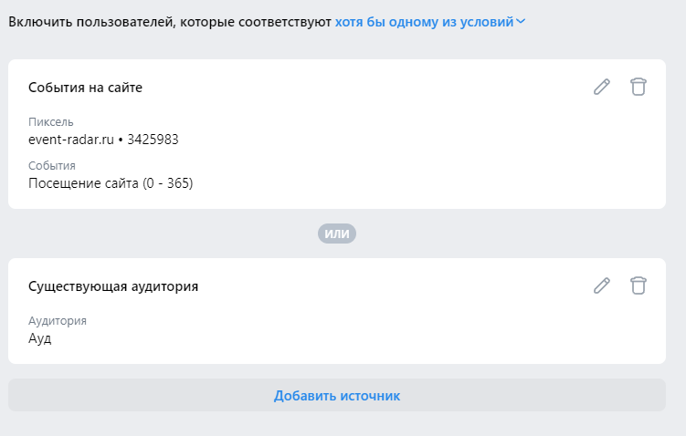
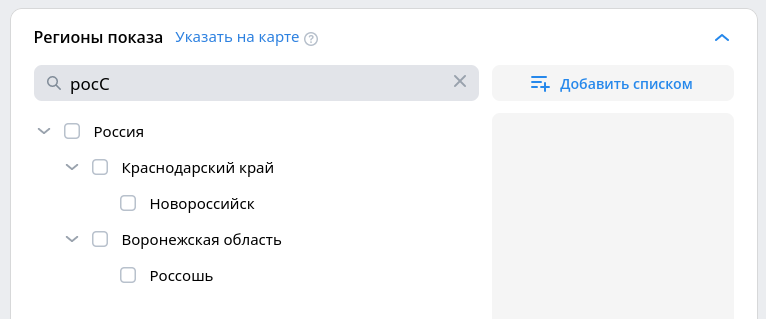

# [VK Реклама](https://ads.vk.com/)

Тестовый аккаунт (авторизация через почту Mail.ru):  
Логин - nekit2321@mail.ru  
Пароль - nekit2321serial  

## Навбар (https://ads.vk.com)

- Навбар. Клик на логотип редиректит на https://ads.vk.com/

- Навбар. Кнопка "Перейти в кабинет" открывает https://id.vk.com

- Навбар. Кнопка "Справка" редиректит на https://ads.vk.com/help 

- Навбар. Клик на таб "Новости" редиректит на https://ads.vk.com/news

- Навбар. Клик на таб "Форум идей" редиректит на https://ads.vk.com/upvote

- Навбар. Клик на таб "Кейсы" редиректит на https://ads.vk.com/cases

- Навбар. Клик на таб "Монетизация" открывает https://ads.vk.com/partner в новой вкладке

- Навбар. При наведении на таб "Обучение" появляется выпадающий список

- Навбар. Выпадающий список "Обучение". Элемент "Полезные материалы" редиректит на https://ads.vk.com/insights
  
- Навбар. Выпадающий список "Обучение". Элемент "Мероприятия" редиректит на https://ads.vk.com/events
  
- Навбар. Выпадающий список "Обучение". Элемент "Видеокурсы" открывает https://expert.vk.com/catalog/courses в новой вкладке
  
- Навбар. Выпадающий список "Обучение". Элемент "Сертификация" открывает https://expert.vk.com/certification в новой вкладке

- Навбар. При ширине экрана < 1025 пикселей все табы прячутся в гамбургер

## Регистрация (https://ads.vk.com/hq/registration)

- Регистрация. Кнопка "Создать новый кабинет" редиректит на https://ads.vk.com/hq/registration/new

- Регистрация. При выборе типа аккаунта "Агентство" нельзя выбрать тип аккаунта "Физическое лицо"

- Регистрация. При выборе страны "Россия" доступные валюты - "Российский рубль (RUB)"
  
- Регистрация. При выборе любой страны, кроме "Россия" доступные валюты - "Доллар США (USD)" и "Евро (EUR)"

- Регистрация. Ошибка "Обязательное поле" при незаполнении поля Email

- Регистрация. Ошибка "Обязательное поле", если не принимать пользовательское соглашение

- Регистрация. Ошибка "Validation Failed" при Email больше 256 символов

- Регистрация. Ошибка при Email неверного формата (нет '@' или '.' после '@', пустые элементы адреса, домен верхнего уровня меньше 2 символов)

- Регистрация. Кнопка "Создать кабинет" редиректит на https://ads.vk.com/hq/dashboard при вводе Email верного формата (example@mail.ru) и принятии пользовательского соглашения

## Аудитории (https://ads.vk.com/hq/audience)
  
- Аудитории. Кнопка "Редактировать" у аудитории открывает модальное окно редактирования аудитории

- Аудитории. Кнопка "Удалить" у аудитории удаляет аудиторию из списка

- Аудитории. Создание. Ошибка при названии аудитории > 255 символов
  
- Аудитории. Создание. Кнопка "Добавить источник" открывает модальное окно выбора источника

- Аудитории. Создание. Существующая аудитория. В селекте "Аудитории" можно выбрать ранее созданные аудитории
  
- Аудитории. Создание. Существующая аудитория. При выборе аудитории и нажатии кнопки "Сохранить", окно выбора аудитории закрывается, выбранная аудитория появляется в списке источников

- Аудитории. Создание. Список пользователей. В селекте "Список пользователей" можно выбрать ранее созданный список пользователей
  
- Аудитории. Создание. Список пользователей. При выборе списка пользователей и нажатии кнопки "Сохранить", окно выбора списка закрывается, выбранный список появляется в списке источников
  
- Аудитории. Создание. Ключевые фразы. Кнопка "Сохранить" становится активной при вводе любого текста в поле "Название" и в хотя бы одно из полей "Ключевые фразы" и "Минус-фразы"

- Аудитории. Создание. Ключевые фразы. Период поиска принимает значения от 1 до 30

- Аудитории. Создание. Ключевые фразы. При вводе данных о ключевых фразах (см. пункт выше) и нажатии кнопки "Сохранить", окно ключевых фраз закрывается, созданное условие появляется в списке источников
      
- Аудитории. Создание. Событие на сайте. В селекте "Пиксель" можно выбрать ранее созданный пиксель

- Аудитории. Создание. Событие на сайте. Клик на свитч "Посещение сайта" делает поле выбора временного периода видимым
  
- Аудитории. Создание. Событие на сайте. Выбор временного периода принимает значения от 0 до 365
  
- Аудитории. Создание. Событие на сайте. При выборе временного периода правая граница всегда не меньше левой
  
- Аудитории. Создание. Окно добавления источников зависит от выбора логики совмещения источников (И/Или/Не)

- Аудитории. Создание. Не позволяет выбрать в качестве источника подписчиков сообщества, если выбран какой-либо другой источник
  
- Аудитории. Создание. Не позволяет добавить какой-либо другой источник при выборе в качестве источника подписчиков сообщества

- Аудитории. Фильтрация. Показывает только аудитории с выбранными источниками

### Группы объявлений (https://ads.vk.com/hq/dashboard/ad_groups)

- Группы объявлений. Клик на название группы объявлений редиректит на список объявлений, принадлежащих группе
  
- Группы объявлений. Кнопка "Редактировать" у группы объявлений открывает модальное окно редактирования группы

- Группы объявлений. При снятии чекбоксов в настройках соответствующие поля не отображаются в таблице

- Группы объявлений. При выделении чекбокса напротив группы объявлений появляется кнопка "Удалить" и тэг "Выбрано: (1)"

- Группы объявлений. При нажатии на крестик в тэге "Выбрано: (...)" снимаются чекбоксы у всех групп объявлений, исчезает кнопка "Удалить" и сам тэг

 
- Группы объявлений. При нажатии на кнопку "Удалить" открывается модальное окно подтверждения удаления

- Группы объявлений. Модальное окно подтверждения удаления. Закрывается при клике на кнопку "Отмена" 

- Группы объявлений. Модальное окно подтверждения удаления. Закрывается при клике на крестик в правом верхнем углу

- Группы объявлений. Модальное окно подтверждения удаления. Закрывается при клике на область экрана вне модального окна

  
- Группы объявлений. Модальное окно подтверждения удаления. При нажатии на кнопку "Удалить" выбранные группы пропадают из списка, связанные объявления также пропадают

- Группы объявлений. Создание. Регионы показа. Позволяет искать регионы по подстроке, регистронезависимо (поисковый запрос "росС" выдаёт регионы "Россия" и "Новороссийск")

- Группы объявлений. Создание. Регионы показа. Добавляет регион в список выбранных при клике
  
- Группы объявлений. Создание. Регионы показа. Удаляет выбранный регион из списка при клике на крестик
 
- Группы объявлений. Создание. Регионы показа. Очищает список регионов при нажатии на кнопку "Очистить все"
  
- Группы объявлений. Создание. Регионы показа. Кнопка "Добавить списком" открывает модальное окно "Добавление списком"
  
- Группы объявлений. Создание. Регионы показа. Добавление списком. При вводе значения "Россия, Москва, 468" и клике на "Добавить" появляется баббл "Добавлены 3 региона", в списке регионов появляются "Россия, Республика Крым, Москва"

- Группы объявлений. Создание. Устройства. Не позволяет выбрать меньше одного типа устройства

- Группы объявлений. Создание. Места размещения. При снятии переключателя "Автоматический выбор..." показывает список мест размещения

- Группы объявлений. Создание. Демография. Правая граница возраста не может быть меньше левой

- Группы объявлений. Создание. Демография. Левая граница возраста не может быть больше правой

- Группы объявлений. Создание. Пользовательские аудитории. Поле поиска аудитории предлагает ранее созданные аудитории

- Группы объявлений. Создание. Пользовательские аудитории. При поиске аудитории кнопка редактирования напротив названия аудитории открывает модальное окно редактирования аудитории
  
- Группы объявлений. Создание. Пользовательские аудитории. Клик на аудиторию при поиске закрывает выпадающее окно поиска и добавляет тэг с названием этой аудитории в поле поиска

- Группы объявлений. Создание. Пользовательские аудитории. Клик на крестик у тэга выбранной аудитории удаляет эту аудиторию из поля поиска

- Группы объявлений. Создание. Пользовательские аудитории. Наведение мыши на тэг выбранной аудитории открывает тултип с кнопкой "Редактировать"

- Группы объявлений. Создание. Пользовательские аудитории. Кнопка "Редактировать" в тултипе тэга аудитории открывает окно редактирования аудитории
  
- Группы объявлений. Создание. Пользовательские аудитории. Нажатие на ссылку "Добавить исключение" добавляет поле поиска аудиторий "Исключая аудитории"
  
- Группы объявлений. Создание. Пользовательские аудитории. Нажатие на крестик напротив поля поиска аудиторий "Исключая аудитории" убирает это поле поиска, заменяет это поле на ссылку "Добавить исключение"
